# Support Agent Flow Documentation

This document describes the complete workflow of the Support Agent system, which automates customer support ticket enrichment by cross-referencing customer data from the Acme database.

## System Overview

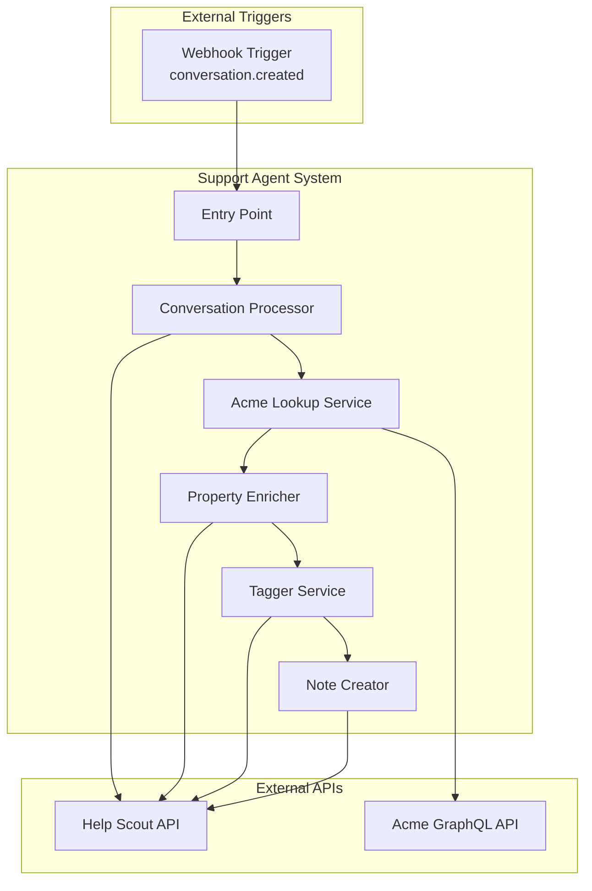

## High-Level Workflow

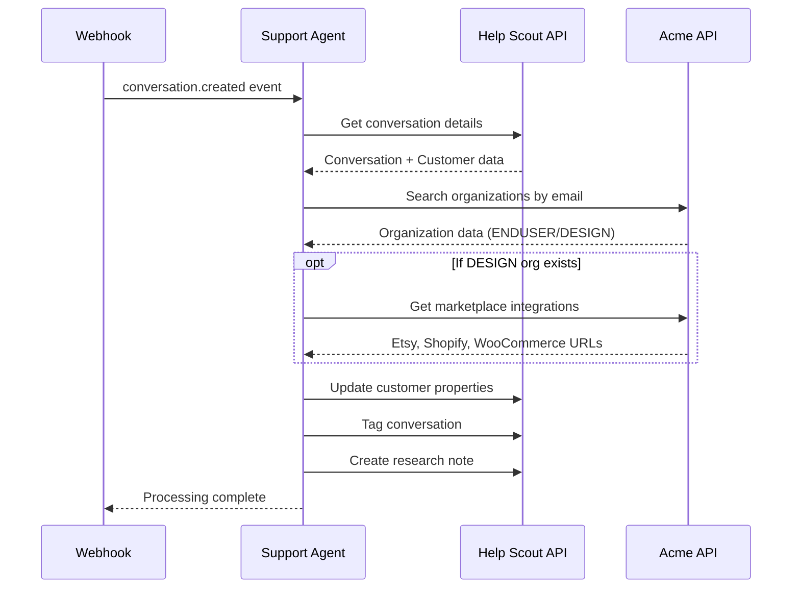

## Detailed Process Flow

### Phase 1: Webhook Reception & Initialization

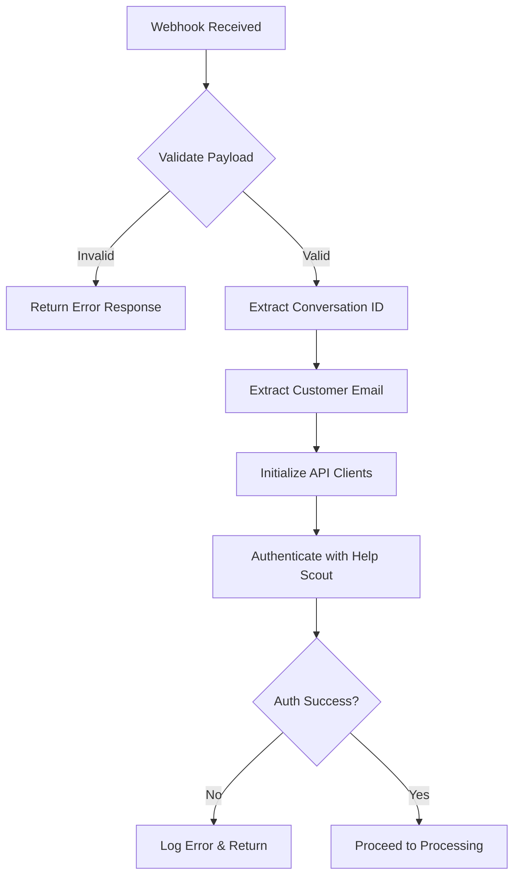

**Webhook Payload Structure:**
```json
{
  "id": 123456789,
  "type": "conversation.created",
  "record": {
    "id": 123456789,
    "number": 12345,
    "type": "email",
    "mailboxId": 100001,
    "status": "active",
    "subject": "Help with...",
    "primaryCustomer": {
      "id": 423735212,
      "email": "customer@example.com"
    }
  }
}
```

### Phase 2: Customer Data Lookup

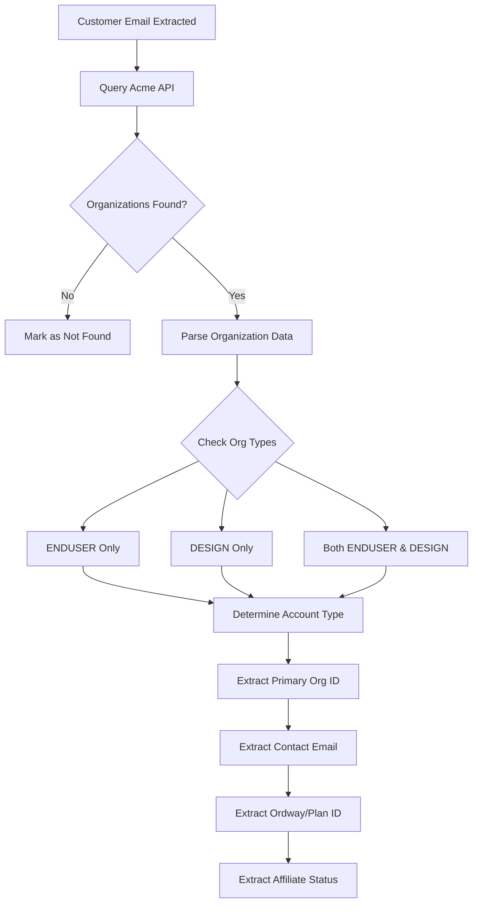

**Organization Types:**
| Type | Description | Properties Available |
|------|-------------|---------------------|
| ENDUSER | End customer/buyer account | orgId, name, status, contactEmail, orderCount |
| DESIGN | Designer/seller account | orgId, name, status, contactEmail, planId, affiliateStatus, integrations |

### Phase 3: Integration Data Retrieval (Designers Only)

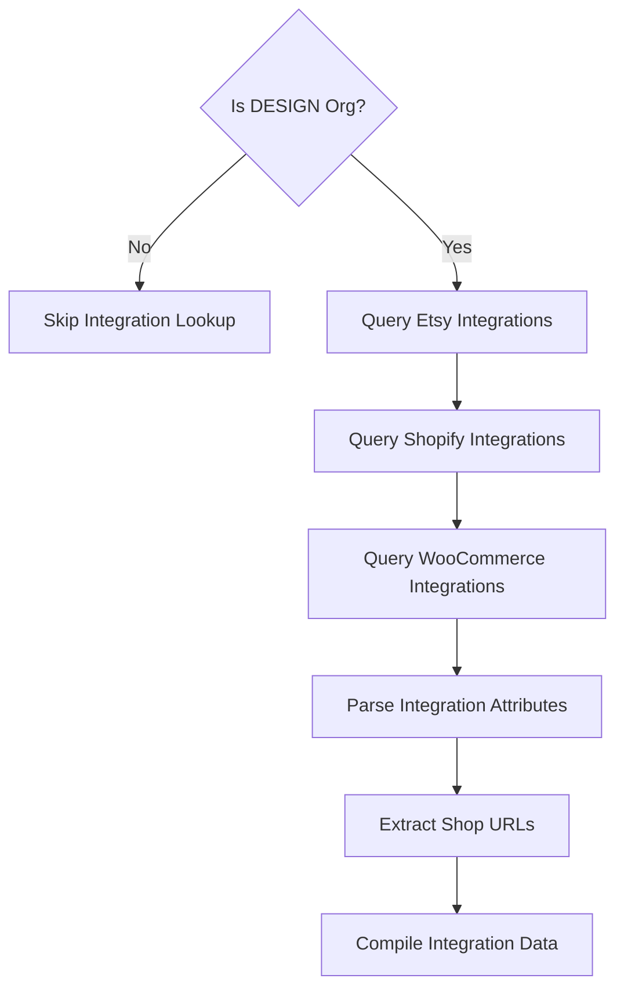

**Integration Sources:**
| Source | URL Field | Attributes JSON Key |
|--------|-----------|-------------------|
| Etsy | shop_url | `attributes.shop_url` |
| Shopify | myshopify_domain | `attributes.shop_url` or domain |
| WooCommerce | site_url | `attributes.shop_url` or site_url |

### Phase 4: Customer Property Enrichment

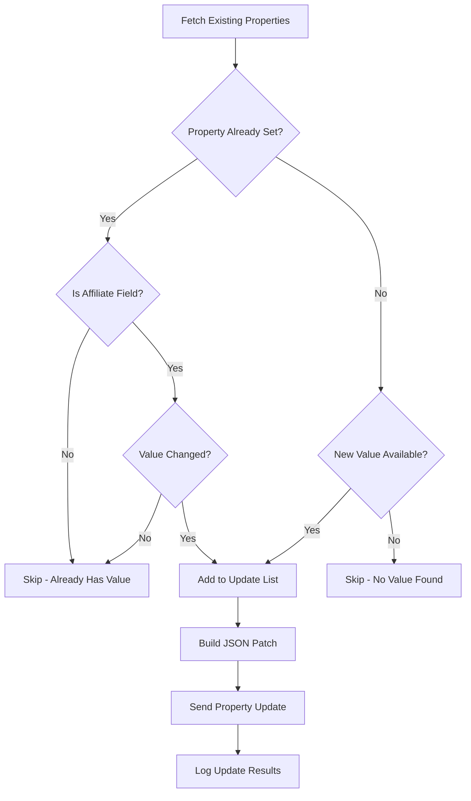

**Customer Properties Updated:**
| Property Name | Slug | Source | Update Logic |
|--------------|------|--------|--------------|
| Account Type | account-type | Org types | Set once |
| Affiliate | affiliate | affiliateAccountId or status | Always update if changed |
| Org ID | org-id | Primary org ID | Set once |
| Org/Contact Email | org-contact-email | Org contact email | Set once |
| Ordway ID | ordway-id | planId | Set once |
| Etsy Shop | etsy-shop | Integration attributes | Set once |
| Shopify Shop | shopify-shop | Integration attributes | Set once |
| WooCommerce Shop | woocommerce-shop | Integration attributes | Set once |

### Phase 5: Conversation Tagging

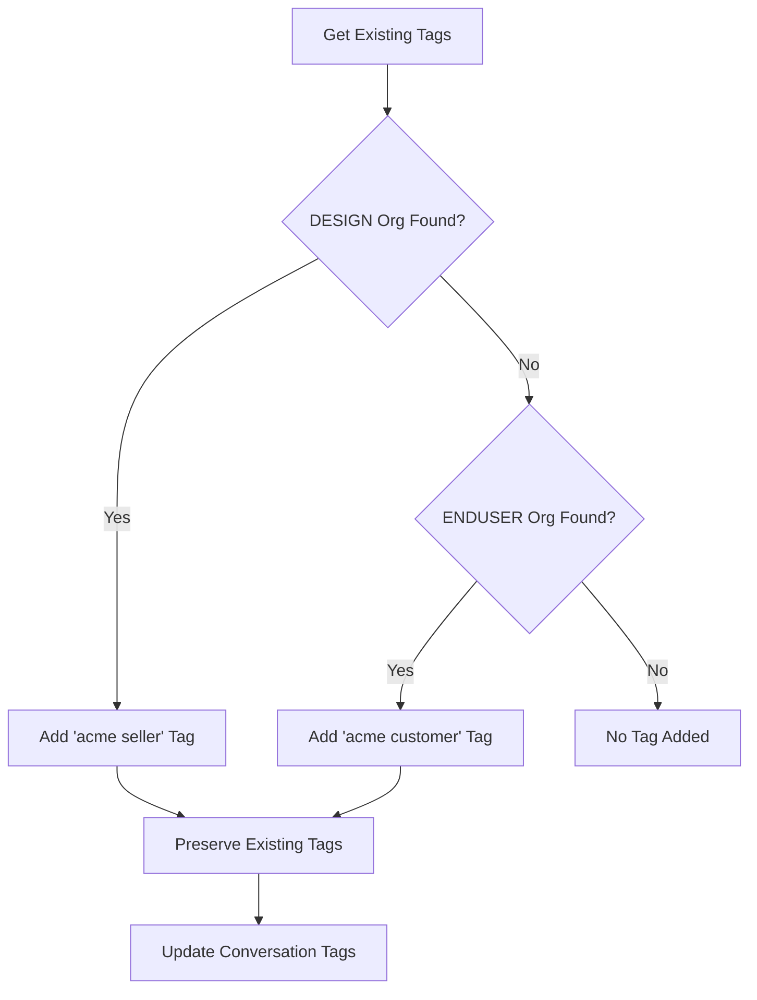

### Phase 6: Research Note Creation

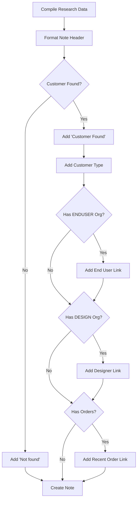

**Note Format:**
```
Research results:
Customer Found
Customer type: Designer & Customer

End User Profile: https://intranet.acme.example/support/end-users/{orgId}
Designer Profile: https://intranet.acme.example/support/designers/{orgId}
Recent Order: https://intranet.acme.example/support/orders/{orderId}
```

## Complete End-to-End Flow

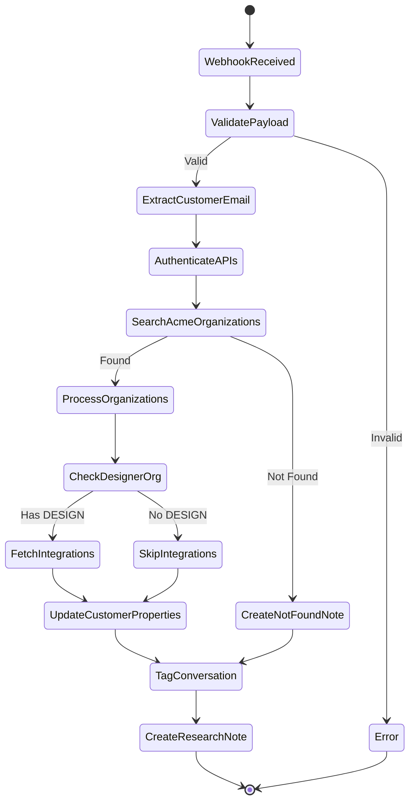

## Data Flow Diagram

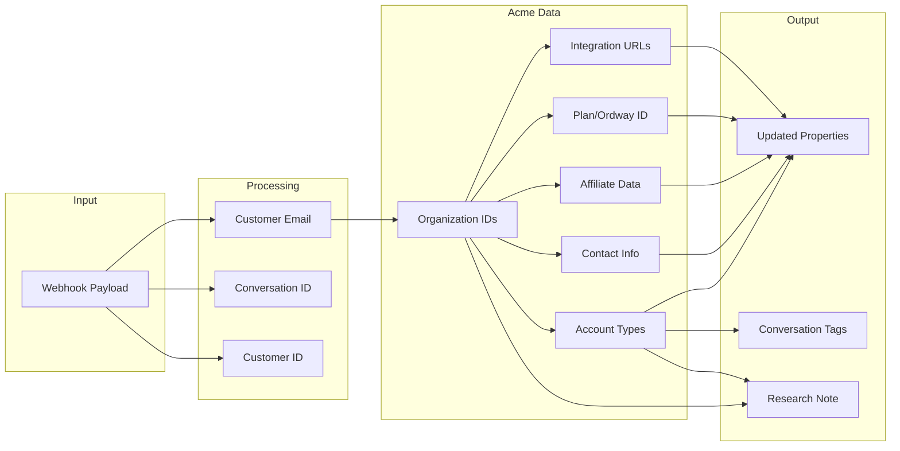

## Error Handling Flow

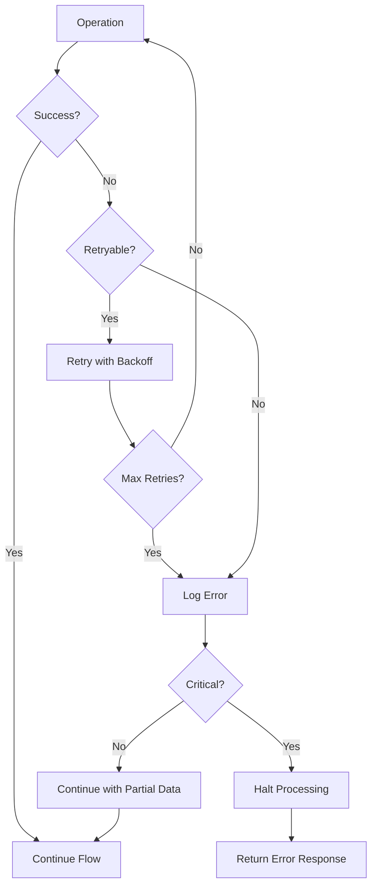

**Error Categories:**
| Category | Examples | Handling |
|----------|----------|----------|
| Authentication | Token expired, Invalid credentials | Retry with refresh |
| Network | Timeout, Connection refused | Retry with exponential backoff |
| API Errors | 400/404 responses | Log and continue |
| Data Issues | Missing fields, Invalid format | Use defaults, continue |
| Critical | 500 errors, Service unavailable | Halt and return error |

## Performance Considerations

```mermaid
gantt
    title Typical Processing Timeline
    dateFormat X
    axisFormat %Lms

    section Authentication
    Auth Token Check    :0, 50

    section Help Scout
    Get Conversation    :50, 150

    section Acme
    Search Orgs         :150, 300
    Get Integrations    :300, 500

    section Updates
    Update Properties   :500, 600
    Update Tags         :600, 700
    Create Note         :700, 800
```

**Key Metrics:**
- Average processing time: 500-800ms
- API calls per request: 4-7 (depending on integrations)
- Retry attempts: Up to 3 per operation
- Token cache duration: ~2 days (with 60s buffer)
