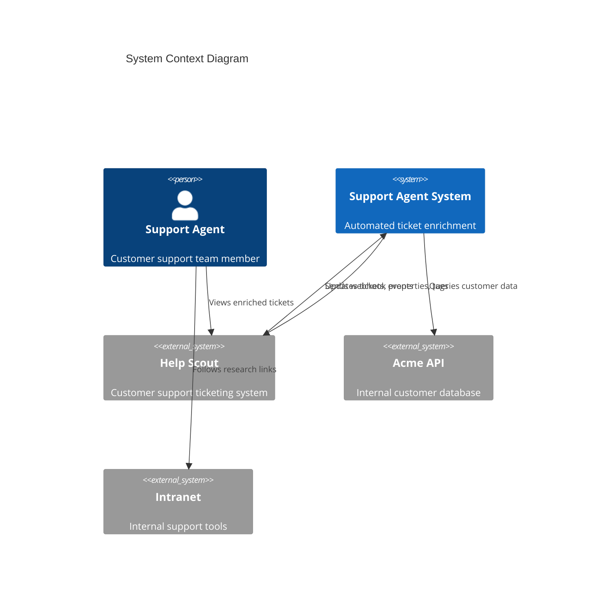
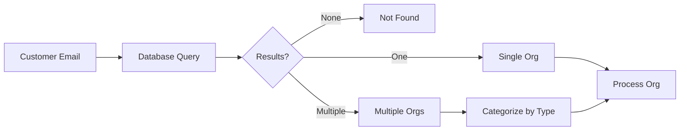
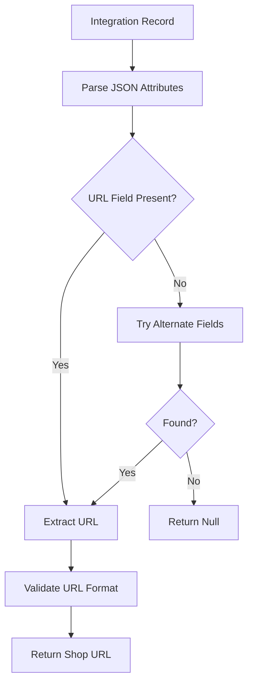
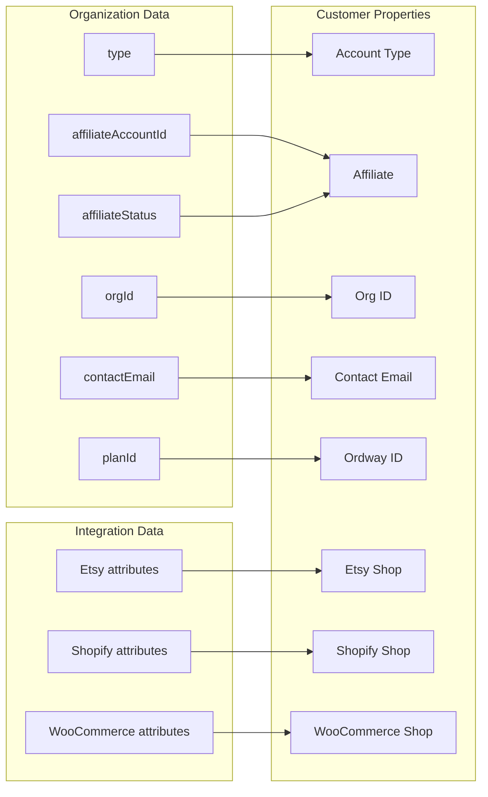
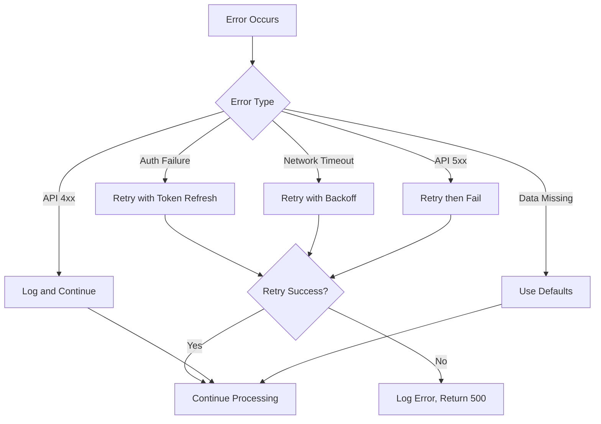
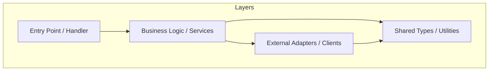
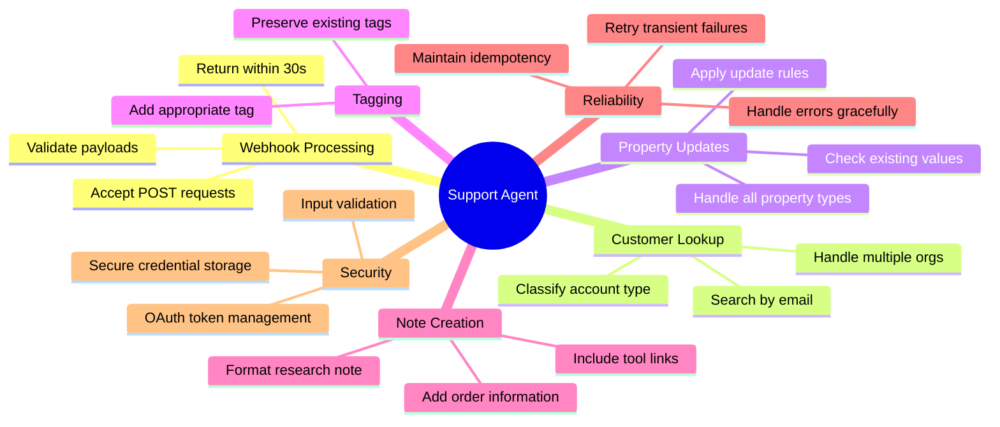

# Support Agent Requirements Specification

This document defines the functional and non-functional requirements for the Support Agent system, a customer support ticket enrichment automation platform.

## 1. Executive Summary

### 1.1 Purpose
Automatically enrich customer support tickets with contextual information from internal databases, reducing manual research time and improving support agent efficiency.

### 1.2 Scope
The system processes incoming support tickets, retrieves customer information from external databases, and updates the ticketing system with enriched data including account type, organization details, and marketplace integrations.

## 2. System Context



## 3. Functional Requirements

### 3.1 Webhook Processing

#### REQ-WH-001: Webhook Reception
**Priority:** Critical
**Description:** The system SHALL accept incoming HTTP POST webhook requests from the ticketing system.

**Acceptance Criteria:**
- Accept POST requests with JSON payload
- Respond within 30 seconds
- Return appropriate HTTP status codes (200 for success, 4xx/5xx for errors)
- Support webhook signature validation (optional)

#### REQ-WH-002: Payload Validation
**Priority:** Critical
**Description:** The system SHALL validate incoming webhook payloads before processing.

**Acceptance Criteria:**
- Validate required fields are present (conversation ID, customer email)
- Reject malformed JSON with 400 status
- Log validation failures for debugging

#### REQ-WH-003: Event Filtering
**Priority:** High
**Description:** The system SHALL process only specific event types.

**Supported Events:**
| Event Type | Action |
|-----------|--------|
| conversation.created | Process for enrichment |
| conversation.updated | Optional - future enhancement |
| Other events | Ignore with 200 response |

### 3.2 Customer Lookup

#### REQ-CL-001: Organization Search
**Priority:** Critical
**Description:** The system SHALL search for customer organizations by email address.

**Acceptance Criteria:**
- Query customer database with email address
- Handle multiple organization matches
- Distinguish between organization types (ENDUSER, DESIGN)
- Support pagination for large result sets



#### REQ-CL-002: Organization Type Classification
**Priority:** Critical
**Description:** The system SHALL classify customers based on their organization types.

**Classification Logic:**
| Scenario | Classification |
|----------|---------------|
| ENDUSER only | "Customer" |
| DESIGN only | "Designer" |
| Both types | "Designer & Customer" |
| No organizations | "Not Found" |

#### REQ-CL-003: Primary Organization Selection
**Priority:** High
**Description:** The system SHALL select a primary organization when multiple exist.

**Selection Priority:**
1. DESIGN organization (if exists)
2. ENDUSER organization (fallback)

### 3.3 Integration Data Retrieval

#### REQ-INT-001: Marketplace Integration Query
**Priority:** Medium
**Description:** The system SHALL retrieve marketplace integration data for designer accounts.

**Supported Marketplaces:**
| Marketplace | Data Retrieved |
|-------------|---------------|
| Etsy | Shop URL |
| Shopify | Shop URL |
| WooCommerce | Shop URL |

#### REQ-INT-002: Integration Attribute Parsing
**Priority:** Medium
**Description:** The system SHALL parse integration attributes to extract shop URLs.

**Parsing Logic:**


### 3.4 Property Enrichment

#### REQ-PE-001: Fetch Existing Properties
**Priority:** Critical
**Description:** The system SHALL retrieve existing customer properties before updating.

**Rationale:** Prevent overwriting manually-set values.

#### REQ-PE-002: Conditional Property Updates
**Priority:** Critical
**Description:** The system SHALL apply conditional logic when updating properties.

**Update Rules:**
| Property | Update Condition |
|----------|-----------------|
| Account Type | Update only if empty |
| Affiliate | Always update if value changed |
| Org ID | Update only if empty |
| Contact Email | Update only if empty |
| Ordway ID | Update only if empty |
| Etsy Shop | Update only if empty |
| Shopify Shop | Update only if empty |
| WooCommerce Shop | Update only if empty |

#### REQ-PE-003: Property Value Extraction
**Priority:** High
**Description:** The system SHALL extract property values from organization data.

**Property Sources:**


### 3.5 Conversation Tagging

#### REQ-TG-001: Automatic Tag Assignment
**Priority:** High
**Description:** The system SHALL automatically tag conversations based on customer type.

**Tagging Logic:**
| Condition | Tag Applied |
|-----------|-------------|
| DESIGN organization found | "acme seller" |
| ENDUSER only (no DESIGN) | "acme customer" |
| No organizations found | No tag added |

#### REQ-TG-002: Tag Preservation
**Priority:** High
**Description:** The system SHALL preserve existing conversation tags when adding new ones.

**Acceptance Criteria:**
- Retrieve existing tags before update
- Merge new tag with existing tags
- Avoid duplicate tags
- Maintain tag order

### 3.6 Research Note Generation

#### REQ-NT-001: Automated Note Creation
**Priority:** High
**Description:** The system SHALL create an internal research note on processed conversations.

**Note Structure:**
```
Research results:
{Status: "Customer Found" | "Not found"}
{Customer type: "Designer" | "Customer" | "Designer & Customer"}

{Links to internal tools}
```

#### REQ-NT-002: Internal Tool Links
**Priority:** High
**Description:** The system SHALL include links to internal support tools in research notes.

**Link Types:**
| Organization Type | Link Format |
|------------------|-------------|
| ENDUSER | `https://intranet.acme.example/support/end-users/{orgId}` |
| DESIGN | `https://intranet.acme.example/support/designers/{orgId}` |
| Recent Order | `https://intranet.acme.example/support/orders/{orderId}` |

#### REQ-NT-003: Order Information
**Priority:** Medium
**Description:** The system SHALL include the most recent order link when available.

**Query Priority:**
1. Claimed orders by organization ID
2. Unclaimed orders by email address

## 4. Non-Functional Requirements

### 4.1 Performance

#### REQ-PF-001: Processing Time
**Priority:** High
**Description:** The system SHALL complete webhook processing within acceptable time limits.

**Metrics:**
| Metric | Target | Maximum |
|--------|--------|---------|
| Average response time | < 1 second | 5 seconds |
| P99 response time | < 3 seconds | 10 seconds |
| Webhook timeout | N/A | 30 seconds |

#### REQ-PF-002: Concurrent Processing
**Priority:** High
**Description:** The system SHALL handle concurrent webhook requests.

**Acceptance Criteria:**
- Support at least 10 concurrent requests
- No race conditions on shared resources
- Graceful degradation under load

### 4.2 Reliability

#### REQ-RL-001: Error Handling
**Priority:** Critical
**Description:** The system SHALL handle errors gracefully without data corruption.

**Error Handling Matrix:**


#### REQ-RL-002: Retry Logic
**Priority:** High
**Description:** The system SHALL implement retry logic for transient failures.

**Retry Configuration:**
| Parameter | Value |
|-----------|-------|
| Max retries | 3 |
| Initial delay | 100ms |
| Backoff multiplier | 2 |
| Max delay | 2 seconds |

#### REQ-RL-003: Idempotency
**Priority:** High
**Description:** The system SHALL handle duplicate webhook deliveries gracefully.

**Acceptance Criteria:**
- Same webhook processed twice produces same result
- No duplicate notes or tags created
- Property updates are idempotent

### 4.3 Security

#### REQ-SC-001: Credential Management
**Priority:** Critical
**Description:** The system SHALL securely manage API credentials.

**Requirements:**
- No hardcoded credentials in source code
- Credentials stored in secure secrets manager
- Credentials encrypted at rest
- Access to credentials logged

#### REQ-SC-002: API Authentication
**Priority:** Critical
**Description:** The system SHALL use secure authentication for all API calls.

**Authentication Methods:**
| API | Method | Details |
|-----|--------|---------|
| Help Scout | OAuth 2.0 | Client credentials flow |
| Acme | API Key | Header-based authentication |

#### REQ-SC-003: Token Management
**Priority:** High
**Description:** The system SHALL properly manage OAuth tokens.

**Requirements:**
- Token refresh before expiration (60s buffer)
- Secure token storage (not logged)
- Token caching to reduce auth requests
- Automatic refresh on 401 responses

#### REQ-SC-004: Input Validation
**Priority:** High
**Description:** The system SHALL validate all external inputs.

**Validation Points:**
- Webhook payload structure
- Email address format
- URL format for integrations
- Response data from APIs

### 4.4 Observability

#### REQ-OB-001: Logging
**Priority:** High
**Description:** The system SHALL log all significant operations.

**Log Levels:**
| Level | Usage |
|-------|-------|
| ERROR | Failures requiring attention |
| WARN | Unexpected but handled conditions |
| INFO | Major operations (start, complete) |
| DEBUG | Detailed operation traces |

**Required Log Fields:**
- Timestamp (ISO 8601)
- Request/Correlation ID
- Operation name
- Duration
- Success/Failure status
- Error details (if applicable)

#### REQ-OB-002: Metrics
**Priority:** Medium
**Description:** The system SHALL expose operational metrics.

**Key Metrics:**
| Metric | Type | Description |
|--------|------|-------------|
| requests_total | Counter | Total webhooks received |
| requests_success | Counter | Successfully processed |
| requests_failed | Counter | Failed processing |
| request_duration_ms | Histogram | Processing time |
| api_calls_total | Counter | External API calls |
| api_errors_total | Counter | External API errors |

#### REQ-OB-003: Alerting
**Priority:** Medium
**Description:** The system SHALL support alerting on error conditions.

**Alert Conditions:**
- Error rate > 5% over 5 minutes
- Response time P99 > 10 seconds
- Authentication failures
- API connectivity issues

### 4.5 Scalability

#### REQ-SC-001: Horizontal Scaling
**Priority:** Medium
**Description:** The system SHALL support horizontal scaling.

**Requirements:**
- Stateless request processing
- No local state dependencies
- Shared nothing architecture
- Load balancer compatible

### 4.6 Maintainability

#### REQ-MT-001: Code Organization
**Priority:** High
**Description:** The system SHALL follow clean architecture principles.

**Structure:**


#### REQ-MT-002: Configuration Management
**Priority:** High
**Description:** The system SHALL externalize all configuration.

**Configuration Items:**
| Item | Type | Environment Variable |
|------|------|---------------------|
| Help Scout App ID | Secret | HELPSCOUT_APP_ID |
| Help Scout Secret | Secret | HELPSCOUT_SECRET |
| Help Scout Mailbox ID | Config | HELPSCOUT_MAILBOX_ID |
| Acme API Endpoint | Config | ACME_API_ENDPOINT |
| Acme API Key | Secret | ACME_API_KEY |
| Log Level | Config | LOG_LEVEL |

## 5. Data Requirements

### 5.1 Input Data

#### Customer Email
- Format: Valid email address
- Source: Webhook payload
- Required: Yes

#### Conversation ID
- Format: Numeric ID
- Source: Webhook payload
- Required: Yes

#### Customer ID
- Format: Numeric ID
- Source: Webhook payload
- Required: Yes

### 5.2 Output Data

#### Customer Properties
| Property | Type | Max Length | Format |
|----------|------|------------|--------|
| Account Type | String | 50 | "Designer", "Customer", or "Designer & Customer" |
| Affiliate | String | 100 | Account ID or status enum |
| Org ID | String | 50 | Organization identifier |
| Contact Email | String | 255 | Valid email address |
| Ordway ID | String | 50 | Plan identifier |
| Etsy Shop | String | 500 | Valid URL |
| Shopify Shop | String | 500 | Valid URL |
| WooCommerce Shop | String | 500 | Valid URL |

#### Conversation Tags
| Tag | Condition |
|-----|-----------|
| "acme seller" | DESIGN organization exists |
| "acme customer" | ENDUSER only exists |

## 6. Interface Requirements

### 6.1 Webhook Endpoint

**Endpoint:** `POST /webhook`

**Request:**
```json
{
  "id": 123456789,
  "type": "conversation.created",
  "record": {
    "id": 123456789,
    "number": 12345,
    "type": "email",
    "mailboxId": 100001,
    "status": "active",
    "subject": "Help with...",
    "primaryCustomer": {
      "id": 423735212,
      "email": "customer@example.com"
    }
  }
}
```

**Response (Success):**
```json
{
  "success": true,
  "conversationId": 123456789,
  "customerFound": true,
  "propertiesUpdated": ["account-type", "org-id"],
  "tagAdded": "acme seller",
  "noteCreated": true
}
```

**Response (Error):**
```json
{
  "success": false,
  "error": "Error message",
  "errorCode": "ERROR_CODE"
}
```

### 6.2 Help Scout API

**Base URL:** `https://api.helpscout.net/v2`

**Required Endpoints:**
| Endpoint | Method | Purpose |
|----------|--------|---------|
| `/oauth2/token` | POST | Get access token |
| `/conversations/{id}` | GET | Get conversation details |
| `/customers/{id}` | GET | Get customer details |
| `/customers/{id}/properties` | PATCH | Update properties |
| `/conversations/{id}/tags` | PUT | Update tags |
| `/conversations/{id}/notes` | POST | Create note |

### 6.3 Acme GraphQL API

**Endpoint:** AWS AppSync GraphQL endpoint

**Required Operations:**
| Operation | Type | Purpose |
|-----------|------|---------|
| supportSearchOrganizations | Query | Search orgs by email |
| listOrdersByBuyerOrgId | Query | Get claimed orders |
| listOrdersByEmail | Query | Get unclaimed orders |
| listIntegrationsByOrg | Query | Get marketplace integrations |

## 7. Constraints

### 7.1 Technical Constraints

- Must use TypeScript for implementation
- Must support Node.js 18+ runtime
- Must handle Help Scout webhook payload format
- Must use GraphQL for Acme API communication
- Must support OAuth 2.0 client credentials flow

### 7.2 Business Constraints

- Do not modify Acme database (read-only)
- Preserve manually-set customer properties
- Processing must not block support agent workflow
- Must handle customers with no organization match

### 7.3 Regulatory Constraints

- Customer data must not be logged in full
- API credentials must be encrypted at rest
- Access to customer data must be authenticated

## 8. Acceptance Criteria Summary


