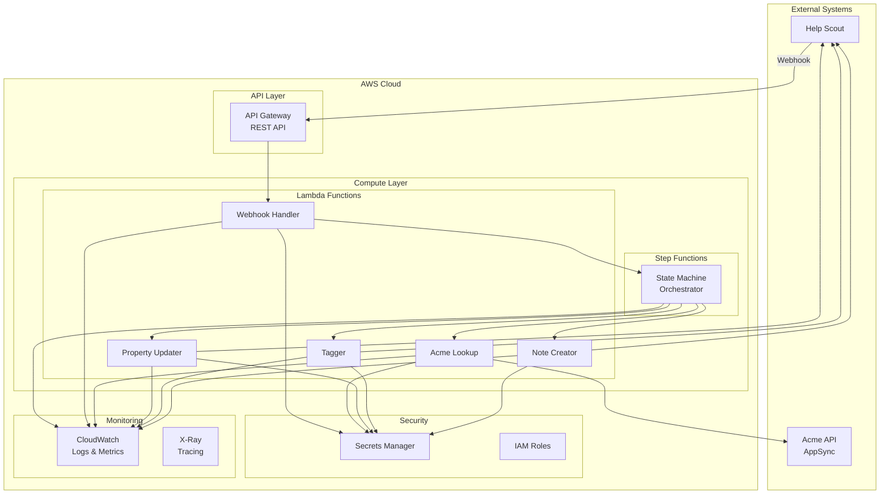
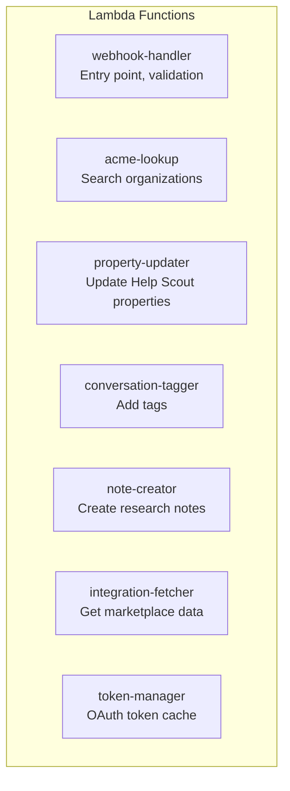
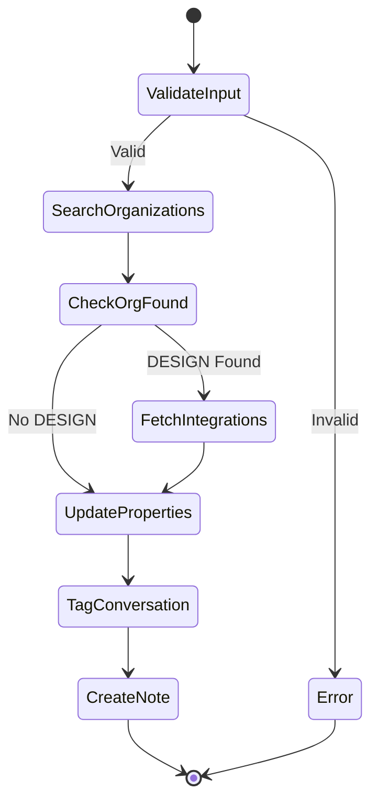
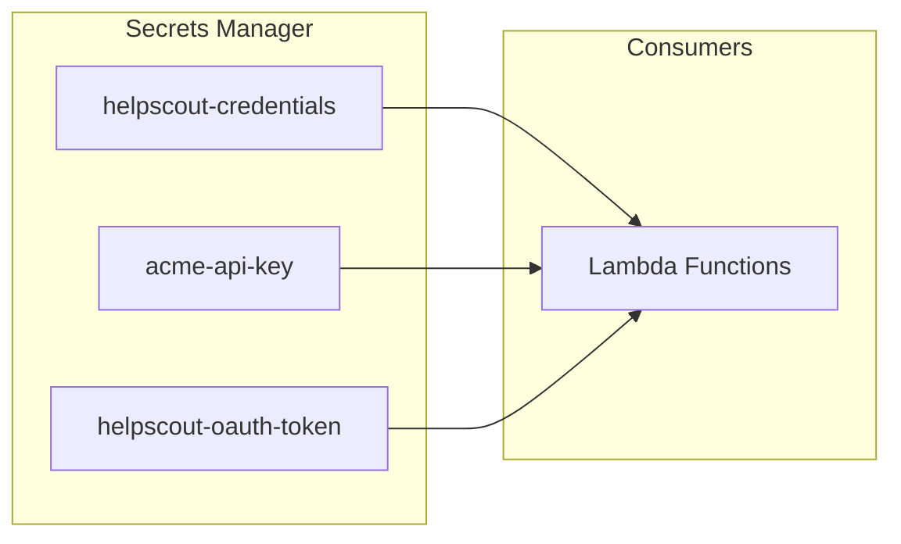
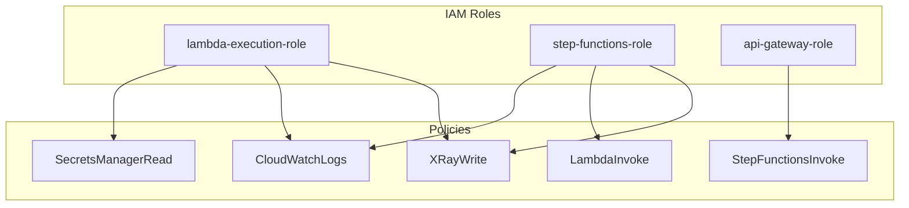
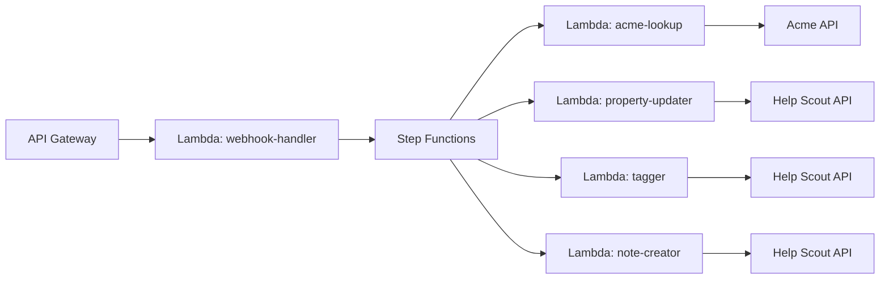
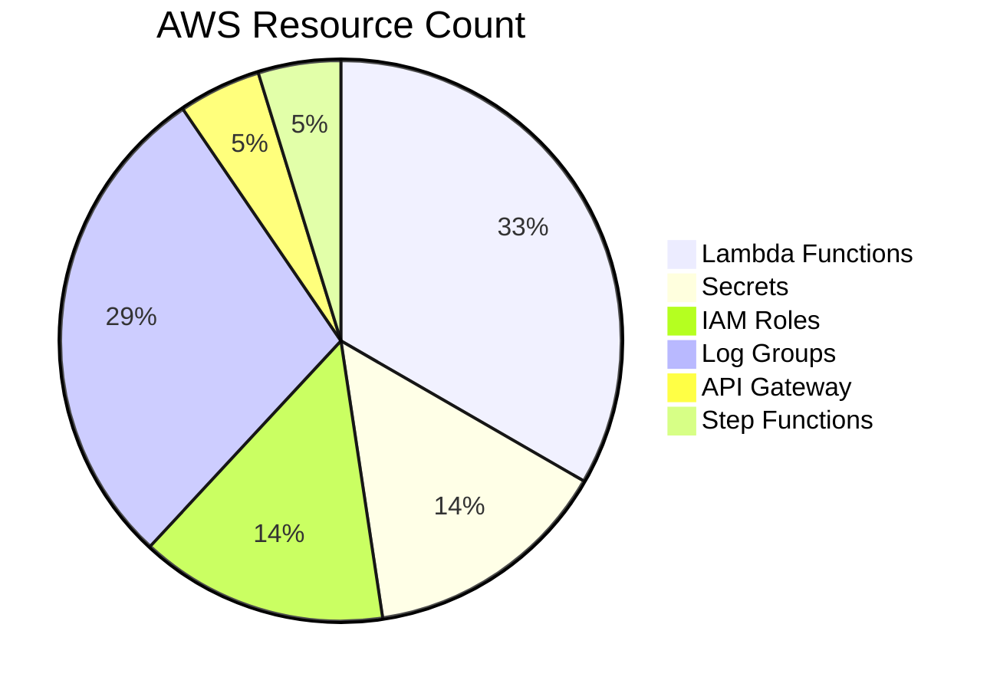
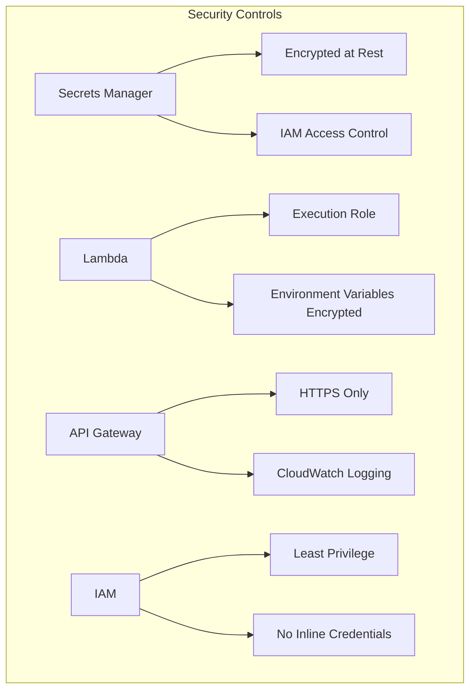

# AWS Services Inventory

This document provides a comprehensive inventory of AWS services required to migrate the Support Agent from n8n to AWS-native infrastructure.

## Architecture Overview



## Service Inventory

### 1. API Gateway

**Purpose:** Expose webhook endpoint for Help Scout to call

**Configuration:**

| Property | Value |
|----------|-------|
| Type | REST API |
| Endpoint Type | Regional |
| Stage | prod |
| Protocol | HTTPS |

**Resources:**

```mermaid
graph LR
    subgraph "API Gateway Resources"
        R[/] --> W[/webhook]
        W --> POST[POST Method]
        POST --> LI[Lambda Integration]
    end
```

| Resource | Method | Integration | Description |
|----------|--------|-------------|-------------|
| `/webhook` | POST | Lambda Proxy | Webhook receiver |
| `/health` | GET | Mock | Health check endpoint |

**Terraform Resource:** `aws_api_gateway_rest_api`

```hcl
resource "aws_api_gateway_rest_api" "support_agent" {
  name        = "support-agent-api"
  description = "Support Agent Webhook API"

  endpoint_configuration {
    types = ["REGIONAL"]
  }
}
```

**Estimated Cost:** ~$3.50/million requests + data transfer

---

### 2. Lambda Functions

**Purpose:** Execute business logic for ticket processing

**Runtime Configuration:**

| Property | Value |
|----------|-------|
| Runtime | nodejs18.x |
| Architecture | arm64 |
| Memory | 256-512 MB |
| Timeout | 30 seconds |
| Provisioned Concurrency | 0 (optional) |

**Function Inventory:**



| Function Name | Memory | Timeout | Description |
|--------------|--------|---------|-------------|
| `webhook-handler` | 256 MB | 30s | Validates webhook, starts Step Function |
| `acme-lookup` | 256 MB | 15s | Searches Acme for organizations |
| `integration-fetcher` | 256 MB | 15s | Fetches marketplace integrations |
| `property-updater` | 256 MB | 15s | Updates Help Scout customer properties |
| `conversation-tagger` | 256 MB | 10s | Adds tags to conversations |
| `note-creator` | 256 MB | 10s | Creates research notes |
| `helpscout-auth` | 128 MB | 10s | Manages OAuth token refresh |

**Terraform Resource:** `aws_lambda_function`

```hcl
resource "aws_lambda_function" "webhook_handler" {
  function_name = "support-agent-webhook-handler"
  runtime       = "nodejs18.x"
  handler       = "index.handler"
  memory_size   = 256
  timeout       = 30
  architectures = ["arm64"]

  environment {
    variables = {
      STATE_MACHINE_ARN = aws_sfn_state_machine.main.arn
    }
  }
}
```

**Estimated Cost:** ~$0.20/million invocations + compute duration

---

### 3. Step Functions

**Purpose:** Orchestrate the multi-step ticket processing workflow

**Configuration:**

| Property | Value |
|----------|-------|
| Type | Standard |
| Logging | ALL |
| Tracing | Enabled |

**State Machine Definition:**



**States:**

| State | Type | Lambda/Next | Description |
|-------|------|-------------|-------------|
| ValidateInput | Task | webhook-handler | Validate webhook payload |
| SearchOrganizations | Task | acme-lookup | Query Acme API |
| CheckOrgFound | Choice | - | Branch on org type |
| FetchIntegrations | Task | integration-fetcher | Get marketplace URLs |
| UpdateProperties | Task | property-updater | Update Help Scout |
| TagConversation | Task | conversation-tagger | Add conversation tag |
| CreateNote | Task | note-creator | Create research note |
| Error | Fail | - | Handle errors |

**Terraform Resource:** `aws_sfn_state_machine`

```hcl
resource "aws_sfn_state_machine" "support_agent" {
  name     = "support-agent-workflow"
  role_arn = aws_iam_role.step_functions.arn

  definition = file("${path.module}/state-machine.json")

  logging_configuration {
    level                  = "ALL"
    include_execution_data = true
    log_destination        = "${aws_cloudwatch_log_group.step_functions.arn}:*"
  }

  tracing_configuration {
    enabled = true
  }
}
```

**Estimated Cost:** ~$25/million state transitions

---

### 4. Secrets Manager

**Purpose:** Securely store API credentials and sensitive configuration

**Secrets Inventory:**



| Secret Name | Type | Contents | Rotation |
|------------|------|----------|----------|
| `support-agent/helpscout-credentials` | API Credentials | app_id, secret | Manual |
| `support-agent/acme-api-key` | API Key | api_key | Manual |
| `support-agent/helpscout-oauth-token` | OAuth Token | access_token, expires_at | Lambda-managed |

**Secret Structure:**

```json
// helpscout-credentials
{
  "app_id": "your-app-id",
  "secret": "your-secret"
}

// acme-api-key
{
  "api_key": "da2-xxxxxxxx",
  "endpoint": "https://xxxxx.appsync-api.us-west-2.amazonaws.com/graphql"
}

// helpscout-oauth-token (managed by Lambda)
{
  "access_token": "xxxxxxx",
  "expires_at": "2024-01-15T00:00:00Z"
}
```

**Terraform Resource:** `aws_secretsmanager_secret`

```hcl
resource "aws_secretsmanager_secret" "helpscout_credentials" {
  name        = "support-agent/helpscout-credentials"
  description = "Help Scout OAuth credentials"
}

resource "aws_secretsmanager_secret" "acme_api_key" {
  name        = "support-agent/acme-api-key"
  description = "Acme GraphQL API credentials"
}
```

**Estimated Cost:** ~$0.40/secret/month + $0.05/10,000 API calls

---

### 5. IAM Roles and Policies

**Purpose:** Provide least-privilege access for all components

**Roles:**



| Role | Service | Attached Policies |
|------|---------|-------------------|
| `support-agent-lambda-role` | Lambda | SecretsManagerRead, CloudWatchLogs, XRayWrite |
| `support-agent-sfn-role` | Step Functions | LambdaInvoke, CloudWatchLogs, XRayWrite |
| `support-agent-apigw-role` | API Gateway | StepFunctionsInvoke |

**Policy Definitions:**

```hcl
# Lambda execution role
resource "aws_iam_role" "lambda_execution" {
  name = "support-agent-lambda-role"

  assume_role_policy = jsonencode({
    Version = "2012-10-17"
    Statement = [{
      Action = "sts:AssumeRole"
      Effect = "Allow"
      Principal = {
        Service = "lambda.amazonaws.com"
      }
    }]
  })
}

# Secrets Manager read policy
resource "aws_iam_role_policy" "secrets_read" {
  name = "secrets-read"
  role = aws_iam_role.lambda_execution.id

  policy = jsonencode({
    Version = "2012-10-17"
    Statement = [{
      Effect = "Allow"
      Action = [
        "secretsmanager:GetSecretValue"
      ]
      Resource = [
        aws_secretsmanager_secret.helpscout_credentials.arn,
        aws_secretsmanager_secret.acme_api_key.arn
      ]
    }]
  })
}
```

**Estimated Cost:** Free

---

### 6. CloudWatch

**Purpose:** Centralized logging, metrics, and alerting

**Components:**

```mermaid
graph TB
    subgraph "CloudWatch"
        subgraph "Log Groups"
            LG1[/aws/lambda/webhook-handler]
            LG2[/aws/lambda/acme-lookup]
            LG3[/aws/stepfunctions/support-agent]
            LG4[/aws/apigateway/support-agent]
        end

        subgraph "Metrics"
            M1[Custom Metrics]
            M2[Lambda Metrics]
            M3[Step Functions Metrics]
        end

        subgraph "Alarms"
            A1[Error Rate Alarm]
            A2[Duration Alarm]
            A3[Throttle Alarm]
        end

        subgraph "Dashboard"
            D1[Operations Dashboard]
        end
    end
```

**Log Groups:**

| Log Group | Retention | Description |
|-----------|-----------|-------------|
| `/aws/lambda/support-agent-*` | 30 days | Lambda function logs |
| `/aws/stepfunctions/support-agent` | 30 days | Step Functions execution logs |
| `/aws/apigateway/support-agent` | 14 days | API Gateway access logs |

**Custom Metrics:**

| Metric | Namespace | Dimensions | Description |
|--------|-----------|------------|-------------|
| `WebhooksProcessed` | SupportAgent | Status | Count of processed webhooks |
| `CustomerLookups` | SupportAgent | Found/NotFound | Customer lookup results |
| `PropertiesUpdated` | SupportAgent | PropertyName | Property update counts |
| `ProcessingDuration` | SupportAgent | Stage | Processing time by stage |

**Alarms:**

| Alarm | Metric | Threshold | Action |
|-------|--------|-----------|--------|
| High Error Rate | Errors/Invocations | > 5% for 5 min | SNS notification |
| Slow Processing | P99 Duration | > 10 seconds | SNS notification |
| Throttling | Throttles | > 0 for 5 min | SNS notification |

**Terraform Resources:**

```hcl
resource "aws_cloudwatch_log_group" "lambda" {
  for_each = toset([
    "webhook-handler",
    "acme-lookup",
    "property-updater",
    "conversation-tagger",
    "note-creator"
  ])

  name              = "/aws/lambda/support-agent-${each.key}"
  retention_in_days = 30
}

resource "aws_cloudwatch_metric_alarm" "error_rate" {
  alarm_name          = "support-agent-high-error-rate"
  comparison_operator = "GreaterThanThreshold"
  evaluation_periods  = 2
  metric_name         = "Errors"
  namespace           = "AWS/Lambda"
  period              = 300
  statistic           = "Sum"
  threshold           = 5
  alarm_description   = "High error rate detected"

  dimensions = {
    FunctionName = aws_lambda_function.webhook_handler.function_name
  }
}
```

**Estimated Cost:** ~$0.50/GB ingested + $0.03/GB stored + $0.30/dashboard

---

### 7. X-Ray (Optional)

**Purpose:** Distributed tracing for debugging and performance analysis

**Configuration:**

| Property | Value |
|----------|-------|
| Sampling Rate | 5% |
| Tracing Mode | Active |
| Service Map | Enabled |

**Trace Map:**



**Terraform Resources:**

```hcl
# X-Ray tracing is enabled via Lambda function configuration
resource "aws_lambda_function" "example" {
  # ... other configuration ...

  tracing_config {
    mode = "Active"
  }
}
```

**Estimated Cost:** ~$5/million traces recorded + $0.50/million traces retrieved

---

### 8. SNS (Optional)

**Purpose:** Alert notifications for operational issues

**Topics:**

| Topic | Subscribers | Purpose |
|-------|-------------|---------|
| `support-agent-alerts` | Email, Slack webhook | Operational alerts |

**Terraform Resources:**

```hcl
resource "aws_sns_topic" "alerts" {
  name = "support-agent-alerts"
}

resource "aws_sns_topic_subscription" "email" {
  topic_arn = aws_sns_topic.alerts.arn
  protocol  = "email"
  endpoint  = var.alert_email
}
```

**Estimated Cost:** ~$0.50/million notifications

---

## Infrastructure Summary

### Required Resources



| Category | Count | Resources |
|----------|-------|-----------|
| Compute | 7 | Lambda functions |
| Orchestration | 1 | Step Functions state machine |
| API | 1 | API Gateway REST API |
| Security | 3 | Secrets Manager secrets |
| IAM | 3 | Roles + policies |
| Monitoring | 6+ | Log groups, metrics, alarms |

### Estimated Monthly Cost

| Service | Low Usage | Medium Usage | High Usage |
|---------|-----------|--------------|------------|
| API Gateway | $1 | $5 | $20 |
| Lambda | $0 | $2 | $10 |
| Step Functions | $1 | $10 | $50 |
| Secrets Manager | $1.50 | $1.50 | $2 |
| CloudWatch | $2 | $5 | $15 |
| X-Ray (optional) | $0 | $2 | $10 |
| **Total** | **~$5** | **~$25** | **~$107** |

*Usage tiers: Low (~1K/month), Medium (~50K/month), High (~500K/month) webhook calls*

---

## Terraform Module Structure

```
terraform/
├── main.tf                 # Main configuration
├── variables.tf            # Input variables
├── outputs.tf              # Output values
├── providers.tf            # AWS provider config
├── versions.tf             # Terraform version constraints
├── api-gateway.tf          # API Gateway resources
├── lambda.tf               # Lambda function resources
├── step-functions.tf       # Step Functions resources
├── secrets.tf              # Secrets Manager resources
├── iam.tf                  # IAM roles and policies
├── cloudwatch.tf           # Logging and monitoring
├── state-machine.json      # Step Functions definition
└── modules/
    └── lambda-function/    # Reusable Lambda module
        ├── main.tf
        ├── variables.tf
        └── outputs.tf
```

---

## Network Considerations

**VPC Configuration:** Not required for this workload

- All external APIs (Help Scout, Acme) are accessed over the public internet
- Lambda functions can run in the default VPC-less configuration
- No private resources requiring VPC access

**If VPC is required in the future:**
- Add VPC configuration to Lambda functions
- Add NAT Gateway for outbound internet access
- Consider VPC endpoints for Secrets Manager

---

## Security Checklist



| Control | Implementation | Status |
|---------|----------------|--------|
| Credential Storage | Secrets Manager | Required |
| Encryption at Rest | AWS KMS (default) | Automatic |
| Encryption in Transit | HTTPS/TLS 1.2+ | Automatic |
| Access Control | IAM roles | Required |
| Logging | CloudWatch | Required |
| Audit Trail | CloudTrail | Automatic |
