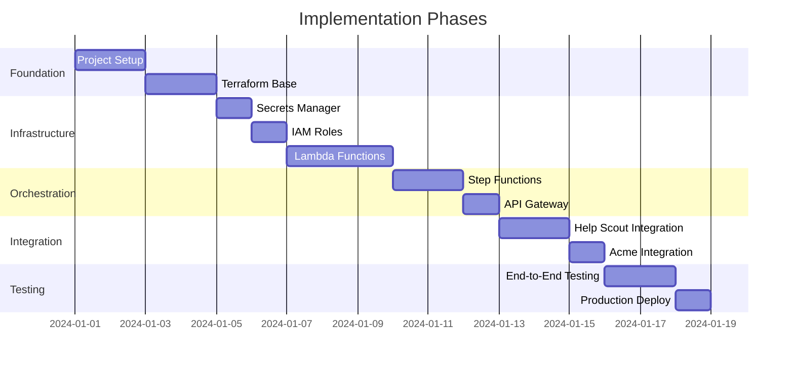

# Support Agent AWS Implementation Plan

This document provides a detailed, step-by-step implementation plan for migrating the Support Agent from n8n to AWS. It is designed to be followed by an LLM or developer with explicit instructions and validation steps.

## Prerequisites Checklist

Before starting implementation, ensure the following are available:

- [ ] AWS account with appropriate permissions
- [ ] AWS CLI configured with named profile
- [ ] Terraform installed (v1.5+)
- [ ] Node.js 18+ installed
- [ ] NX CLI installed globally (`npm install -g nx`)
- [ ] Help Scout OAuth credentials (App ID and Secret)
- [ ] Acme API endpoint and API key
- [ ] Help Scout Mailbox ID

## Implementation Phases



---

## Phase 1: Project Setup

### Step 1.1: Initialize NX Workspace

**Action:** Create a new NX monorepo workspace for the project.

```bash
# Navigate to the project directory
cd ~/Code/support-agent-aws

# Initialize NX workspace
npx create-nx-workspace@latest . --preset=ts --name=support-agent-aws --nxCloud=skip

# Install additional dependencies
npm install aws-sdk @aws-sdk/client-secrets-manager @aws-sdk/client-sfn axios
npm install -D @types/aws-lambda esbuild @nx/esbuild
```

**Validation:**
```bash
# Verify NX is set up correctly
nx --version
# Expected: Shows NX version (e.g., 17.x.x)

# Verify package.json exists
cat package.json | grep "name"
# Expected: "name": "support-agent-aws"

# Verify node_modules installed
ls node_modules/@aws-sdk
# Expected: Shows client-secrets-manager, client-sfn directories
```

### Step 1.2: Create Project Structure

**Action:** Create the folder structure for Lambda functions and Terraform.

```bash
# Create directory structure
mkdir -p libs/shared/src
mkdir -p libs/helpscout-client/src
mkdir -p libs/acme-client/src
mkdir -p apps/webhook-handler/src
mkdir -p apps/acme-lookup/src
mkdir -p apps/integration-fetcher/src
mkdir -p apps/property-updater/src
mkdir -p apps/conversation-tagger/src
mkdir -p apps/note-creator/src
mkdir -p terraform/modules/lambda-function
mkdir -p terraform/environments/prod
mkdir -p scripts
```

**Validation:**
```bash
# Verify directory structure
find . -type d -name "src" | sort
# Expected: Shows all src directories created

tree -L 3 -d
# Expected: Shows full directory tree
```

### Step 1.3: Configure NX Project.json Files

**Action:** Create project.json for each Lambda application.

**File: `apps/webhook-handler/project.json`**
```json
{
  "name": "webhook-handler",
  "$schema": "../../node_modules/nx/schemas/project-schema.json",
  "sourceRoot": "apps/webhook-handler/src",
  "projectType": "application",
  "targets": {
    "build": {
      "executor": "@nx/esbuild:esbuild",
      "outputs": ["{options.outputPath}"],
      "options": {
        "outputPath": "dist/apps/webhook-handler",
        "main": "apps/webhook-handler/src/index.ts",
        "tsConfig": "apps/webhook-handler/tsconfig.app.json",
        "platform": "node",
        "format": ["cjs"],
        "bundle": true,
        "minify": true,
        "generatePackageJson": true
      }
    }
  }
}
```

**Repeat for each Lambda function** (acme-lookup, integration-fetcher, property-updater, conversation-tagger, note-creator).

**Validation:**
```bash
# List all NX projects
nx show projects
# Expected: Lists webhook-handler, acme-lookup, etc.
```

---

## Phase 2: Shared Libraries

### Step 2.1: Create Shared Types

**Action:** Create shared TypeScript types used across all Lambda functions.

**File: `libs/shared/src/types.ts`**
```typescript
// Help Scout types
export interface HelpScoutWebhookPayload {
  id: number;
  type: string;
  record: {
    id: number;
    number: number;
    type: string;
    mailboxId: number;
    status: string;
    subject: string;
    primaryCustomer: {
      id: number;
      email: string;
      first?: string;
      last?: string;
    };
  };
}

export interface ProcessingContext {
  conversationId: number;
  customerId: number;
  customerEmail: string;
  organizations?: Organization[];
  designOrg?: Organization;
  enduserOrg?: Organization;
  integrations?: Integration[];
  propertiesUpdated?: string[];
  tagAdded?: string;
  noteCreated?: boolean;
  errors?: ProcessingError[];
}

export interface Organization {
  orgId: string;
  type: 'ENDUSER' | 'DESIGN';
  status: string;
  name: string;
  contactEmail: string;
  planId?: string;
  affiliateAccountId?: string;
  affiliateStatus?: string;
}

export interface Integration {
  integrationId: string;
  orgId: string;
  source: 'ETSY' | 'SHOPIFY' | 'WOOCOMMERCE';
  status: string;
  attributes: string; // JSON string
}

export interface ProcessingError {
  step: string;
  message: string;
  recoverable: boolean;
}

// Step Function event types
export interface StepFunctionEvent {
  context: ProcessingContext;
}

export interface StepFunctionResult {
  success: boolean;
  context: ProcessingContext;
  error?: string;
}
```

**File: `libs/shared/src/index.ts`**
```typescript
export * from './types';
export * from './secrets';
export * from './logger';
```

**Validation:**
```bash
# Compile the shared library
nx build shared
# Expected: Build succeeds without errors

# Check output
ls dist/libs/shared
# Expected: Shows compiled JavaScript files
```

### Step 2.2: Create Secrets Utility

**Action:** Create a utility for fetching secrets from AWS Secrets Manager.

**File: `libs/shared/src/secrets.ts`**
```typescript
import {
  SecretsManagerClient,
  GetSecretValueCommand
} from '@aws-sdk/client-secrets-manager';

const client = new SecretsManagerClient({});
const secretCache: Map<string, { value: any; expiresAt: number }> = new Map();
const CACHE_TTL_MS = 5 * 60 * 1000; // 5 minutes

export interface HelpScoutCredentials {
  app_id: string;
  secret: string;
}

export interface AcmeCredentials {
  api_key: string;
  endpoint: string;
}

export interface HelpScoutToken {
  access_token: string;
  expires_at: string;
}

export async function getSecret<T>(secretName: string): Promise<T> {
  const now = Date.now();
  const cached = secretCache.get(secretName);

  if (cached && cached.expiresAt > now) {
    return cached.value as T;
  }

  const command = new GetSecretValueCommand({ SecretId: secretName });
  const response = await client.send(command);

  if (!response.SecretString) {
    throw new Error(`Secret ${secretName} has no string value`);
  }

  const value = JSON.parse(response.SecretString) as T;
  secretCache.set(secretName, { value, expiresAt: now + CACHE_TTL_MS });

  return value;
}

export async function getHelpScoutCredentials(): Promise<HelpScoutCredentials> {
  return getSecret<HelpScoutCredentials>('support-agent/helpscout-credentials');
}

export async function getAcmeCredentials(): Promise<AcmeCredentials> {
  return getSecret<AcmeCredentials>('support-agent/acme-api-key');
}

export async function getHelpScoutToken(): Promise<HelpScoutToken | null> {
  try {
    return await getSecret<HelpScoutToken>('support-agent/helpscout-oauth-token');
  } catch (error) {
    return null;
  }
}
```

**Validation:**
```bash
# Build shared library
nx build shared
# Expected: Build succeeds

# Check secrets.js is compiled
cat dist/libs/shared/secrets.js | head -20
# Expected: Shows compiled JavaScript with SecretsManagerClient
```

### Step 2.3: Create Logger Utility

**Action:** Create a structured logging utility.

**File: `libs/shared/src/logger.ts`**
```typescript
export type LogLevel = 'DEBUG' | 'INFO' | 'WARN' | 'ERROR';

export interface LogEntry {
  timestamp: string;
  level: LogLevel;
  message: string;
  requestId?: string;
  data?: Record<string, unknown>;
}

let currentRequestId: string | undefined;

export function setRequestId(requestId: string): void {
  currentRequestId = requestId;
}

function log(level: LogLevel, message: string, data?: Record<string, unknown>): void {
  const entry: LogEntry = {
    timestamp: new Date().toISOString(),
    level,
    message,
    requestId: currentRequestId,
    data,
  };

  const logFn = level === 'ERROR' ? console.error :
                level === 'WARN' ? console.warn :
                console.log;

  logFn(JSON.stringify(entry));
}

export const logger = {
  debug: (message: string, data?: Record<string, unknown>) => log('DEBUG', message, data),
  info: (message: string, data?: Record<string, unknown>) => log('INFO', message, data),
  warn: (message: string, data?: Record<string, unknown>) => log('WARN', message, data),
  error: (message: string, data?: Record<string, unknown>) => log('ERROR', message, data),
};
```

**Validation:**
```bash
# Build and verify
nx build shared
# Expected: Build succeeds
```

---

## Phase 3: Help Scout Client Library

### Step 3.1: Create Help Scout Client

**Action:** Create a reusable Help Scout API client library.

**File: `libs/helpscout-client/src/index.ts`**
```typescript
import axios, { AxiosInstance } from 'axios';
import {
  getHelpScoutCredentials,
  getHelpScoutToken,
  HelpScoutCredentials,
  HelpScoutToken
} from '@support-agent-aws/shared';
import {
  SecretsManagerClient,
  PutSecretValueCommand
} from '@aws-sdk/client-secrets-manager';

const TOKEN_REFRESH_BUFFER_SECONDS = 60;

export class HelpScoutClient {
  private client: AxiosInstance;
  private accessToken: string | null = null;
  private tokenExpiresAt: Date | null = null;
  private credentials: HelpScoutCredentials | null = null;

  constructor() {
    this.client = axios.create({
      baseURL: 'https://api.helpscout.net/v2',
      headers: {
        'Content-Type': 'application/json',
      },
    });
  }

  private async ensureAuthenticated(): Promise<void> {
    const now = new Date();

    // Check if current token is still valid
    if (this.accessToken && this.tokenExpiresAt) {
      const bufferTime = new Date(this.tokenExpiresAt.getTime() - TOKEN_REFRESH_BUFFER_SECONDS * 1000);
      if (now < bufferTime) {
        return;
      }
    }

    // Try to load cached token from Secrets Manager
    const cachedToken = await getHelpScoutToken();
    if (cachedToken) {
      const expiresAt = new Date(cachedToken.expires_at);
      const bufferTime = new Date(expiresAt.getTime() - TOKEN_REFRESH_BUFFER_SECONDS * 1000);
      if (now < bufferTime) {
        this.accessToken = cachedToken.access_token;
        this.tokenExpiresAt = expiresAt;
        return;
      }
    }

    // Fetch new token
    await this.authenticate();
  }

  private async authenticate(): Promise<void> {
    if (!this.credentials) {
      this.credentials = await getHelpScoutCredentials();
    }

    const response = await axios.post('https://api.helpscout.net/v2/oauth2/token', {
      grant_type: 'client_credentials',
      client_id: this.credentials.app_id,
      client_secret: this.credentials.secret,
    });

    this.accessToken = response.data.access_token;
    this.tokenExpiresAt = new Date(Date.now() + response.data.expires_in * 1000);

    // Cache token in Secrets Manager
    const secretsClient = new SecretsManagerClient({});
    await secretsClient.send(new PutSecretValueCommand({
      SecretId: 'support-agent/helpscout-oauth-token',
      SecretString: JSON.stringify({
        access_token: this.accessToken,
        expires_at: this.tokenExpiresAt.toISOString(),
      }),
    }));
  }

  private async request<T>(method: string, url: string, data?: unknown): Promise<T> {
    await this.ensureAuthenticated();

    const response = await this.client.request<T>({
      method,
      url,
      data,
      headers: {
        Authorization: `Bearer ${this.accessToken}`,
      },
    });

    return response.data;
  }

  async getConversation(conversationId: number): Promise<any> {
    return this.request('GET', `/conversations/${conversationId}?embed=threads`);
  }

  async getCustomer(customerId: number): Promise<any> {
    return this.request('GET', `/customers/${customerId}`);
  }

  async updateCustomerProperties(
    customerId: number,
    properties: Array<{ op: string; path: string; value: string }>
  ): Promise<void> {
    await this.request('PATCH', `/customers/${customerId}/properties`, properties);
  }

  async updateConversationTags(conversationId: number, tags: string[]): Promise<void> {
    await this.request('PUT', `/conversations/${conversationId}/tags`, { tags });
  }

  async createNote(conversationId: number, text: string): Promise<void> {
    await this.request('POST', `/conversations/${conversationId}/notes`, { text });
  }
}

export const helpScoutClient = new HelpScoutClient();
```

**File: `libs/helpscout-client/project.json`**
```json
{
  "name": "helpscout-client",
  "$schema": "../../node_modules/nx/schemas/project-schema.json",
  "sourceRoot": "libs/helpscout-client/src",
  "projectType": "library",
  "targets": {
    "build": {
      "executor": "@nx/js:tsc",
      "outputs": ["{options.outputPath}"],
      "options": {
        "outputPath": "dist/libs/helpscout-client",
        "main": "libs/helpscout-client/src/index.ts",
        "tsConfig": "libs/helpscout-client/tsconfig.lib.json"
      }
    }
  }
}
```

**Validation:**
```bash
# Build the library
nx build helpscout-client
# Expected: Build succeeds

# Verify output
ls dist/libs/helpscout-client
# Expected: Shows index.js and other compiled files
```

---

## Phase 4: Acme Client Library

### Step 4.1: Create Acme GraphQL Client

**Action:** Create a client for the Acme GraphQL API.

**File: `libs/acme-client/src/index.ts`**
```typescript
import axios from 'axios';
import { getAcmeCredentials, Organization, Integration } from '@support-agent-aws/shared';

export class AcmeClient {
  private endpoint: string | null = null;
  private apiKey: string | null = null;

  private async ensureCredentials(): Promise<void> {
    if (this.endpoint && this.apiKey) {
      return;
    }

    const credentials = await getAcmeCredentials();
    this.endpoint = credentials.endpoint;
    this.apiKey = credentials.api_key;
  }

  private async query<T>(query: string, variables: Record<string, unknown>): Promise<T> {
    await this.ensureCredentials();

    const response = await axios.post(
      this.endpoint!,
      { query, variables },
      {
        headers: {
          'Content-Type': 'application/json',
          'x-api-key': this.apiKey!,
        },
      }
    );

    if (response.data.errors) {
      throw new Error(`GraphQL error: ${JSON.stringify(response.data.errors)}`);
    }

    return response.data.data;
  }

  async searchOrganizationsByEmail(email: string): Promise<Organization[]> {
    const query = `
      query SupportSearchOrganizations($searchTerms: SupportOrganizationsSearchTermsInput!, $pagination: PaginationInput!) {
        supportSearchOrganizations(searchTerms: $searchTerms, pagination: $pagination) {
          items {
            orgId
            type
            status
            name
            contactEmail
            planId
            affiliateAccountId
            affiliateStatus
          }
        }
      }
    `;

    const result = await this.query<{ supportSearchOrganizations: { items: Organization[] } }>(
      query,
      {
        searchTerms: {
          searchString: email,
          sort: { sortField: 'createdAt', sortDirection: 'DESC' },
        },
        pagination: { resultsPerPage: 50, pageNumber: 1 },
      }
    );

    return result.supportSearchOrganizations.items;
  }

  async listIntegrationsByOrg(orgId: string): Promise<Integration[]> {
    const query = `
      query ListIntegrationsByOrg($orgId: ID!, $limit: Int) {
        listIntegrationsByOrg(orgId: $orgId, limit: $limit) {
          items {
            integrationId
            orgId
            source
            status
            attributes
          }
        }
      }
    `;

    const result = await this.query<{ listIntegrationsByOrg: { items: Integration[] } }>(
      query,
      { orgId, limit: 50 }
    );

    return result.listIntegrationsByOrg.items;
  }

  async listOrdersByBuyerOrgId(buyerOrgId: string, limit: number = 10): Promise<any[]> {
    const query = `
      query ListOrdersByBuyerOrgId($buyerOrgId: ID!, $sortDirection: ModelSortDirection, $limit: Int) {
        listOrdersByBuyerOrgId(buyerOrgId: $buyerOrgId, sortDirection: $sortDirection, limit: $limit) {
          items {
            orderId
            status
            createdAt
          }
        }
      }
    `;

    const result = await this.query<{ listOrdersByBuyerOrgId: { items: any[] } }>(
      query,
      { buyerOrgId, sortDirection: 'DESC', limit }
    );

    return result.listOrdersByBuyerOrgId.items;
  }

  async listOrdersByEmail(email: string, limit: number = 10): Promise<any[]> {
    const query = `
      query ListOrdersByEmail($emailAddress: String!, $sortDirection: ModelSortDirection, $limit: Int) {
        listOrdersByEmail(emailAddress: $emailAddress, sortDirection: $sortDirection, limit: $limit) {
          items {
            orderId
            status
            createdAt
          }
        }
      }
    `;

    const result = await this.query<{ listOrdersByEmail: { items: any[] } }>(
      query,
      { emailAddress: email, sortDirection: 'DESC', limit }
    );

    return result.listOrdersByEmail.items;
  }
}

export const acmeClient = new AcmeClient();
```

**Validation:**
```bash
# Build the library
nx build acme-client
# Expected: Build succeeds
```

---

## Phase 5: Lambda Functions

### Step 5.1: Webhook Handler Lambda

**Action:** Create the entry-point Lambda that receives webhooks and starts the Step Function.

**File: `apps/webhook-handler/src/index.ts`**
```typescript
import { APIGatewayProxyEvent, APIGatewayProxyResult } from 'aws-lambda';
import { SFNClient, StartExecutionCommand } from '@aws-sdk/client-sfn';
import {
  HelpScoutWebhookPayload,
  ProcessingContext,
  logger,
  setRequestId
} from '@support-agent-aws/shared';

const sfnClient = new SFNClient({});
const STATE_MACHINE_ARN = process.env.STATE_MACHINE_ARN!;

export async function handler(event: APIGatewayProxyEvent): Promise<APIGatewayProxyResult> {
  const requestId = event.requestContext.requestId;
  setRequestId(requestId);

  logger.info('Webhook received', { requestId });

  try {
    // Parse and validate payload
    if (!event.body) {
      logger.error('Missing request body');
      return { statusCode: 400, body: JSON.stringify({ error: 'Missing body' }) };
    }

    const payload: HelpScoutWebhookPayload = JSON.parse(event.body);

    // Only process conversation.created events
    if (payload.type !== 'conversation.created') {
      logger.info('Ignoring non-conversation.created event', { type: payload.type });
      return { statusCode: 200, body: JSON.stringify({ message: 'Event ignored' }) };
    }

    // Validate required fields
    if (!payload.record?.primaryCustomer?.email) {
      logger.error('Missing customer email in payload');
      return { statusCode: 400, body: JSON.stringify({ error: 'Missing customer email' }) };
    }

    // Create processing context
    const context: ProcessingContext = {
      conversationId: payload.record.id,
      customerId: payload.record.primaryCustomer.id,
      customerEmail: payload.record.primaryCustomer.email,
      errors: [],
    };

    logger.info('Starting Step Function execution', {
      conversationId: context.conversationId,
      customerEmail: context.customerEmail
    });

    // Start Step Function execution
    await sfnClient.send(new StartExecutionCommand({
      stateMachineArn: STATE_MACHINE_ARN,
      name: `webhook-${payload.record.id}-${Date.now()}`,
      input: JSON.stringify({ context }),
    }));

    logger.info('Step Function started successfully');

    return {
      statusCode: 200,
      body: JSON.stringify({
        success: true,
        conversationId: context.conversationId
      }),
    };
  } catch (error) {
    const message = error instanceof Error ? error.message : 'Unknown error';
    logger.error('Webhook processing failed', { error: message });

    return {
      statusCode: 500,
      body: JSON.stringify({ error: 'Internal server error' }),
    };
  }
}
```

**Validation:**
```bash
# Build the Lambda
nx build webhook-handler
# Expected: Build succeeds

# Verify output structure
ls dist/apps/webhook-handler
# Expected: Shows index.js, package.json
```

### Step 5.2: Acme Lookup Lambda

**Action:** Create Lambda that searches Acme for customer organizations.

**File: `apps/acme-lookup/src/index.ts`**
```typescript
import {
  StepFunctionEvent,
  StepFunctionResult,
  logger,
  setRequestId
} from '@support-agent-aws/shared';
import { acmeClient } from '@support-agent-aws/acme-client';

export async function handler(event: StepFunctionEvent): Promise<StepFunctionResult> {
  const { context } = event;
  setRequestId(`lookup-${context.conversationId}`);

  logger.info('Starting Acme lookup', { email: context.customerEmail });

  try {
    // Search for organizations by email
    const organizations = await acmeClient.searchOrganizationsByEmail(context.customerEmail);

    logger.info('Organizations found', { count: organizations.length });

    // Categorize organizations
    const designOrg = organizations.find(org => org.type === 'DESIGN');
    const enduserOrg = organizations.find(org => org.type === 'ENDUSER');

    context.organizations = organizations;
    context.designOrg = designOrg;
    context.enduserOrg = enduserOrg;

    logger.info('Lookup complete', {
      hasDesign: !!designOrg,
      hasEnduser: !!enduserOrg,
    });

    return { success: true, context };
  } catch (error) {
    const message = error instanceof Error ? error.message : 'Unknown error';
    logger.error('Acme lookup failed', { error: message });

    context.errors = context.errors || [];
    context.errors.push({
      step: 'acme-lookup',
      message,
      recoverable: true,
    });

    return { success: false, context, error: message };
  }
}
```

**Validation:**
```bash
nx build acme-lookup
# Expected: Build succeeds
```

### Step 5.3: Integration Fetcher Lambda

**Action:** Create Lambda that fetches marketplace integrations for designer accounts.

**File: `apps/integration-fetcher/src/index.ts`**
```typescript
import {
  StepFunctionEvent,
  StepFunctionResult,
  logger,
  setRequestId
} from '@support-agent-aws/shared';
import { acmeClient } from '@support-agent-aws/acme-client';

export async function handler(event: StepFunctionEvent): Promise<StepFunctionResult> {
  const { context } = event;
  setRequestId(`integrations-${context.conversationId}`);

  logger.info('Starting integration fetch');

  try {
    // Only fetch integrations if there's a DESIGN org
    if (!context.designOrg) {
      logger.info('No DESIGN org, skipping integration fetch');
      context.integrations = [];
      return { success: true, context };
    }

    const integrations = await acmeClient.listIntegrationsByOrg(context.designOrg.orgId);

    logger.info('Integrations found', { count: integrations.length });

    context.integrations = integrations;

    return { success: true, context };
  } catch (error) {
    const message = error instanceof Error ? error.message : 'Unknown error';
    logger.error('Integration fetch failed', { error: message });

    context.errors = context.errors || [];
    context.errors.push({
      step: 'integration-fetcher',
      message,
      recoverable: true,
    });
    context.integrations = [];

    return { success: true, context }; // Continue despite error
  }
}
```

**Validation:**
```bash
nx build integration-fetcher
# Expected: Build succeeds
```

### Step 5.4: Property Updater Lambda

**Action:** Create Lambda that updates Help Scout customer properties.

**File: `apps/property-updater/src/index.ts`**
```typescript
import {
  StepFunctionEvent,
  StepFunctionResult,
  logger,
  setRequestId,
  Organization,
  Integration
} from '@support-agent-aws/shared';
import { helpScoutClient } from '@support-agent-aws/helpscout-client';

function determineAccountType(orgs: Organization[]): string | null {
  const hasDesign = orgs.some(o => o.type === 'DESIGN');
  const hasEnduser = orgs.some(o => o.type === 'ENDUSER');

  if (hasDesign && hasEnduser) return 'Designer & Customer';
  if (hasDesign) return 'Designer';
  if (hasEnduser) return 'Customer';
  return null;
}

function getAffiliateValue(orgs: Organization[]): string | null {
  const designOrg = orgs.find(o => o.type === 'DESIGN');
  if (designOrg?.affiliateAccountId) return designOrg.affiliateAccountId;
  if (designOrg?.affiliateStatus) return designOrg.affiliateStatus;
  return null;
}

function getPrimaryOrgId(orgs: Organization[]): string | null {
  const designOrg = orgs.find(o => o.type === 'DESIGN');
  if (designOrg) return designOrg.orgId;
  const enduserOrg = orgs.find(o => o.type === 'ENDUSER');
  return enduserOrg?.orgId || null;
}

function getShopUrl(integrations: Integration[], source: string): string | null {
  const integration = integrations.find(i => i.source === source && i.status === 'ACTIVE');
  if (!integration) return null;

  try {
    const attrs = JSON.parse(integration.attributes);
    return attrs.shop_url || attrs.site_url || attrs.myshopify_domain || null;
  } catch {
    return null;
  }
}

export async function handler(event: StepFunctionEvent): Promise<StepFunctionResult> {
  const { context } = event;
  setRequestId(`properties-${context.conversationId}`);

  logger.info('Starting property update');

  try {
    const orgs = context.organizations || [];
    const integrations = context.integrations || [];

    if (orgs.length === 0) {
      logger.info('No organizations found, skipping property update');
      context.propertiesUpdated = [];
      return { success: true, context };
    }

    // Get existing customer properties
    const customer = await helpScoutClient.getCustomer(context.customerId);
    const existingProps = customer.properties || {};

    // Build property updates
    const updates: Array<{ op: string; path: string; value: string }> = [];
    const updated: string[] = [];

    // Account Type
    const accountType = determineAccountType(orgs);
    if (accountType && !existingProps['account-type']) {
      updates.push({ op: 'replace', path: '/account-type', value: accountType });
      updated.push('account-type');
    }

    // Affiliate (always update if changed)
    const affiliate = getAffiliateValue(orgs);
    if (affiliate && existingProps['affiliate'] !== affiliate) {
      updates.push({ op: 'replace', path: '/affiliate', value: affiliate });
      updated.push('affiliate');
    }

    // Org ID
    const orgId = getPrimaryOrgId(orgs);
    if (orgId && !existingProps['org-id']) {
      updates.push({ op: 'replace', path: '/org-id', value: orgId });
      updated.push('org-id');
    }

    // Ordway ID
    const designOrg = orgs.find(o => o.type === 'DESIGN');
    if (designOrg?.planId && !existingProps['ordway-id']) {
      updates.push({ op: 'replace', path: '/ordway-id', value: designOrg.planId });
      updated.push('ordway-id');
    }

    // Contact Email
    if (designOrg?.contactEmail &&
        designOrg.contactEmail !== context.customerEmail &&
        !existingProps['org-contact-email']) {
      updates.push({ op: 'replace', path: '/org-contact-email', value: designOrg.contactEmail });
      updated.push('org-contact-email');
    }

    // Shop URLs
    const etsyUrl = getShopUrl(integrations, 'ETSY');
    if (etsyUrl && !existingProps['etsy-shop']) {
      updates.push({ op: 'replace', path: '/etsy-shop', value: etsyUrl });
      updated.push('etsy-shop');
    }

    const shopifyUrl = getShopUrl(integrations, 'SHOPIFY');
    if (shopifyUrl && !existingProps['shopify-shop']) {
      updates.push({ op: 'replace', path: '/shopify-shop', value: shopifyUrl });
      updated.push('shopify-shop');
    }

    const wooUrl = getShopUrl(integrations, 'WOOCOMMERCE');
    if (wooUrl && !existingProps['woocommerce-shop']) {
      updates.push({ op: 'replace', path: '/woocommerce-shop', value: wooUrl });
      updated.push('woocommerce-shop');
    }

    // Apply updates
    if (updates.length > 0) {
      await helpScoutClient.updateCustomerProperties(context.customerId, updates);
      logger.info('Properties updated', { properties: updated });
    } else {
      logger.info('No properties to update');
    }

    context.propertiesUpdated = updated;

    return { success: true, context };
  } catch (error) {
    const message = error instanceof Error ? error.message : 'Unknown error';
    logger.error('Property update failed', { error: message });

    context.errors = context.errors || [];
    context.errors.push({
      step: 'property-updater',
      message,
      recoverable: false,
    });

    return { success: false, context, error: message };
  }
}
```

**Validation:**
```bash
nx build property-updater
# Expected: Build succeeds
```

### Step 5.5: Conversation Tagger Lambda

**Action:** Create Lambda that adds tags to conversations.

**File: `apps/conversation-tagger/src/index.ts`**
```typescript
import {
  StepFunctionEvent,
  StepFunctionResult,
  logger,
  setRequestId
} from '@support-agent-aws/shared';
import { helpScoutClient } from '@support-agent-aws/helpscout-client';

export async function handler(event: StepFunctionEvent): Promise<StepFunctionResult> {
  const { context } = event;
  setRequestId(`tagger-${context.conversationId}`);

  logger.info('Starting conversation tagging');

  try {
    // Determine tag to add
    let tagToAdd: string | null = null;

    if (context.designOrg) {
      tagToAdd = 'acme seller';
    } else if (context.enduserOrg) {
      tagToAdd = 'acme customer';
    }

    if (!tagToAdd) {
      logger.info('No tag to add (no organizations found)');
      return { success: true, context };
    }

    // Get existing conversation to preserve tags
    const conversation = await helpScoutClient.getConversation(context.conversationId);
    const existingTags = conversation.tags?.map((t: any) => t.name) || [];

    // Check if tag already exists
    if (existingTags.includes(tagToAdd)) {
      logger.info('Tag already exists', { tag: tagToAdd });
      context.tagAdded = tagToAdd;
      return { success: true, context };
    }

    // Add new tag while preserving existing ones
    const newTags = [...existingTags, tagToAdd];
    await helpScoutClient.updateConversationTags(context.conversationId, newTags);

    logger.info('Tag added', { tag: tagToAdd });
    context.tagAdded = tagToAdd;

    return { success: true, context };
  } catch (error) {
    const message = error instanceof Error ? error.message : 'Unknown error';
    logger.error('Tagging failed', { error: message });

    context.errors = context.errors || [];
    context.errors.push({
      step: 'conversation-tagger',
      message,
      recoverable: true,
    });

    return { success: true, context }; // Continue despite error
  }
}
```

**Validation:**
```bash
nx build conversation-tagger
# Expected: Build succeeds
```

### Step 5.6: Note Creator Lambda

**Action:** Create Lambda that creates research notes.

**File: `apps/note-creator/src/index.ts`**
```typescript
import {
  StepFunctionEvent,
  StepFunctionResult,
  logger,
  setRequestId
} from '@support-agent-aws/shared';
import { helpScoutClient } from '@support-agent-aws/helpscout-client';
import { acmeClient } from '@support-agent-aws/acme-client';

export async function handler(event: StepFunctionEvent): Promise<StepFunctionResult> {
  const { context } = event;
  setRequestId(`note-${context.conversationId}`);

  logger.info('Starting note creation');

  try {
    const orgs = context.organizations || [];
    const lines: string[] = ['Research results:'];

    // Customer found status
    if (orgs.length > 0) {
      lines.push('Customer Found');

      // Customer type
      const hasDesign = !!context.designOrg;
      const hasEnduser = !!context.enduserOrg;

      if (hasDesign && hasEnduser) {
        lines.push('Customer type: Designer & Customer');
      } else if (hasDesign) {
        lines.push('Customer type: Designer');
      } else if (hasEnduser) {
        lines.push('Customer type: Enduser');
      }

      lines.push('');

      // Add profile links
      if (context.enduserOrg) {
        lines.push(`End User Profile: https://intranet.acme.example/support/end-users/${context.enduserOrg.orgId}`);
      }
      if (context.designOrg) {
        lines.push(`Designer Profile: https://intranet.acme.example/support/designers/${context.designOrg.orgId}`);
      }

      // Try to get most recent order
      try {
        let orders: any[] = [];

        if (context.enduserOrg) {
          orders = await acmeClient.listOrdersByBuyerOrgId(context.enduserOrg.orgId, 1);
        }

        if (orders.length === 0) {
          orders = await acmeClient.listOrdersByEmail(context.customerEmail, 1);
        }

        if (orders.length > 0) {
          lines.push(`Recent Order: https://intranet.acme.example/support/orders/${orders[0].orderId}`);
        }
      } catch (orderError) {
        logger.warn('Failed to fetch orders for note', { error: orderError });
      }
    } else {
      lines.push('Not found');
    }

    const noteText = lines.join('\n');

    await helpScoutClient.createNote(context.conversationId, noteText);

    logger.info('Note created');
    context.noteCreated = true;

    return { success: true, context };
  } catch (error) {
    const message = error instanceof Error ? error.message : 'Unknown error';
    logger.error('Note creation failed', { error: message });

    context.errors = context.errors || [];
    context.errors.push({
      step: 'note-creator',
      message,
      recoverable: true,
    });
    context.noteCreated = false;

    return { success: true, context }; // Continue despite error
  }
}
```

**Validation:**
```bash
nx build note-creator
# Expected: Build succeeds

# Build all Lambda functions
nx run-many --target=build --all
# Expected: All builds succeed
```

---

## Phase 6: Terraform Infrastructure

### Step 6.1: Create Terraform Provider Configuration

**Action:** Set up Terraform AWS provider configuration.

**File: `terraform/providers.tf`**
```hcl
terraform {
  required_version = ">= 1.5.0"

  required_providers {
    aws = {
      source  = "hashicorp/aws"
      version = "~> 5.0"
    }
    archive = {
      source  = "hashicorp/archive"
      version = "~> 2.0"
    }
  }
}

provider "aws" {
  region  = var.aws_region
  profile = var.aws_profile

  default_tags {
    tags = {
      Project     = "support-agent"
      Environment = var.environment
      ManagedBy   = "terraform"
    }
  }
}
```

**File: `terraform/variables.tf`**
```hcl
variable "aws_region" {
  description = "AWS region to deploy resources"
  type        = string
  default     = "us-west-2"
}

variable "aws_profile" {
  description = "AWS CLI profile to use"
  type        = string
  default     = "default"
}

variable "environment" {
  description = "Environment name (dev, staging, prod)"
  type        = string
  default     = "prod"
}

variable "helpscout_mailbox_id" {
  description = "Help Scout mailbox ID"
  type        = string
}

variable "alert_email" {
  description = "Email address for alerts"
  type        = string
  default     = ""
}
```

**Validation:**
```bash
cd terraform
terraform init
# Expected: Terraform initializes successfully
```

### Step 6.2: Create Secrets Manager Resources

**Action:** Create Secrets Manager secrets for API credentials.

**File: `terraform/secrets.tf`**
```hcl
# Help Scout OAuth credentials
resource "aws_secretsmanager_secret" "helpscout_credentials" {
  name        = "support-agent/helpscout-credentials"
  description = "Help Scout OAuth App ID and Secret"
}

# Acme API credentials
resource "aws_secretsmanager_secret" "acme_api_key" {
  name        = "support-agent/acme-api-key"
  description = "Acme GraphQL API endpoint and key"
}

# Help Scout OAuth token (managed by Lambda)
resource "aws_secretsmanager_secret" "helpscout_oauth_token" {
  name        = "support-agent/helpscout-oauth-token"
  description = "Cached Help Scout OAuth token"
}

# Initial empty values (user will update via AWS Console)
resource "aws_secretsmanager_secret_version" "helpscout_credentials_initial" {
  secret_id = aws_secretsmanager_secret.helpscout_credentials.id
  secret_string = jsonencode({
    app_id = "PLACEHOLDER_APP_ID"
    secret = "PLACEHOLDER_SECRET"
  })

  lifecycle {
    ignore_changes = [secret_string]
  }
}

resource "aws_secretsmanager_secret_version" "acme_api_key_initial" {
  secret_id = aws_secretsmanager_secret.acme_api_key.id
  secret_string = jsonencode({
    api_key  = "PLACEHOLDER_API_KEY"
    endpoint = "https://placeholder.appsync-api.us-west-2.amazonaws.com/graphql"
  })

  lifecycle {
    ignore_changes = [secret_string]
  }
}

resource "aws_secretsmanager_secret_version" "helpscout_oauth_token_initial" {
  secret_id = aws_secretsmanager_secret.helpscout_oauth_token.id
  secret_string = jsonencode({
    access_token = ""
    expires_at   = "1970-01-01T00:00:00Z"
  })

  lifecycle {
    ignore_changes = [secret_string]
  }
}
```

**Validation:**
```bash
terraform plan -target=aws_secretsmanager_secret.helpscout_credentials
# Expected: Shows plan to create secret
```

### Step 6.3: Create IAM Roles

**Action:** Create IAM roles and policies for Lambda and Step Functions.

**File: `terraform/iam.tf`**
```hcl
# Lambda execution role
resource "aws_iam_role" "lambda_execution" {
  name = "support-agent-lambda-role"

  assume_role_policy = jsonencode({
    Version = "2012-10-17"
    Statement = [{
      Action = "sts:AssumeRole"
      Effect = "Allow"
      Principal = {
        Service = "lambda.amazonaws.com"
      }
    }]
  })
}

# Lambda basic execution policy
resource "aws_iam_role_policy_attachment" "lambda_basic" {
  role       = aws_iam_role.lambda_execution.name
  policy_arn = "arn:aws:iam::aws:policy/service-role/AWSLambdaBasicExecutionRole"
}

# Lambda X-Ray policy
resource "aws_iam_role_policy_attachment" "lambda_xray" {
  role       = aws_iam_role.lambda_execution.name
  policy_arn = "arn:aws:iam::aws:policy/AWSXRayDaemonWriteAccess"
}

# Secrets Manager read policy for Lambda
resource "aws_iam_role_policy" "lambda_secrets_read" {
  name = "secrets-read"
  role = aws_iam_role.lambda_execution.id

  policy = jsonencode({
    Version = "2012-10-17"
    Statement = [{
      Effect = "Allow"
      Action = [
        "secretsmanager:GetSecretValue"
      ]
      Resource = [
        aws_secretsmanager_secret.helpscout_credentials.arn,
        aws_secretsmanager_secret.acme_api_key.arn,
        aws_secretsmanager_secret.helpscout_oauth_token.arn
      ]
    }]
  })
}

# Secrets Manager write policy for OAuth token updates
resource "aws_iam_role_policy" "lambda_secrets_write" {
  name = "secrets-write"
  role = aws_iam_role.lambda_execution.id

  policy = jsonencode({
    Version = "2012-10-17"
    Statement = [{
      Effect = "Allow"
      Action = [
        "secretsmanager:PutSecretValue"
      ]
      Resource = [
        aws_secretsmanager_secret.helpscout_oauth_token.arn
      ]
    }]
  })
}

# Step Functions execution role
resource "aws_iam_role" "step_functions" {
  name = "support-agent-sfn-role"

  assume_role_policy = jsonencode({
    Version = "2012-10-17"
    Statement = [{
      Action = "sts:AssumeRole"
      Effect = "Allow"
      Principal = {
        Service = "states.amazonaws.com"
      }
    }]
  })
}

# Step Functions Lambda invoke policy
resource "aws_iam_role_policy" "sfn_lambda_invoke" {
  name = "lambda-invoke"
  role = aws_iam_role.step_functions.id

  policy = jsonencode({
    Version = "2012-10-17"
    Statement = [{
      Effect   = "Allow"
      Action   = "lambda:InvokeFunction"
      Resource = "arn:aws:lambda:${var.aws_region}:*:function:support-agent-*"
    }]
  })
}

# Step Functions CloudWatch Logs policy
resource "aws_iam_role_policy" "sfn_cloudwatch" {
  name = "cloudwatch-logs"
  role = aws_iam_role.step_functions.id

  policy = jsonencode({
    Version = "2012-10-17"
    Statement = [{
      Effect = "Allow"
      Action = [
        "logs:CreateLogDelivery",
        "logs:GetLogDelivery",
        "logs:UpdateLogDelivery",
        "logs:DeleteLogDelivery",
        "logs:ListLogDeliveries",
        "logs:PutResourcePolicy",
        "logs:DescribeResourcePolicies",
        "logs:DescribeLogGroups"
      ]
      Resource = "*"
    }]
  })
}

# Step Functions X-Ray policy
resource "aws_iam_role_policy_attachment" "sfn_xray" {
  role       = aws_iam_role.step_functions.name
  policy_arn = "arn:aws:iam::aws:policy/AWSXRayDaemonWriteAccess"
}

# Policy for webhook-handler to start Step Functions
resource "aws_iam_role_policy" "lambda_sfn_start" {
  name = "sfn-start-execution"
  role = aws_iam_role.lambda_execution.id

  policy = jsonencode({
    Version = "2012-10-17"
    Statement = [{
      Effect   = "Allow"
      Action   = "states:StartExecution"
      Resource = aws_sfn_state_machine.support_agent.arn
    }]
  })
}
```

**Validation:**
```bash
terraform plan -target=aws_iam_role.lambda_execution
# Expected: Shows plan to create IAM role
```

### Step 6.4: Create Lambda Functions

**Action:** Create Lambda function resources.

**File: `terraform/lambda.tf`**
```hcl
locals {
  lambda_functions = {
    webhook-handler = {
      memory  = 256
      timeout = 30
      handler = "index.handler"
      environment = {
        STATE_MACHINE_ARN = aws_sfn_state_machine.support_agent.arn
      }
    }
    acme-lookup = {
      memory  = 256
      timeout = 15
      handler = "index.handler"
      environment = {}
    }
    integration-fetcher = {
      memory  = 256
      timeout = 15
      handler = "index.handler"
      environment = {}
    }
    property-updater = {
      memory  = 256
      timeout = 15
      handler = "index.handler"
      environment = {}
    }
    conversation-tagger = {
      memory  = 256
      timeout = 10
      handler = "index.handler"
      environment = {}
    }
    note-creator = {
      memory  = 256
      timeout = 10
      handler = "index.handler"
      environment = {}
    }
  }
}

# Archive Lambda code
data "archive_file" "lambda" {
  for_each = local.lambda_functions

  type        = "zip"
  source_dir  = "${path.module}/../dist/apps/${each.key}"
  output_path = "${path.module}/.terraform/lambda-${each.key}.zip"
}

# CloudWatch Log Groups
resource "aws_cloudwatch_log_group" "lambda" {
  for_each = local.lambda_functions

  name              = "/aws/lambda/support-agent-${each.key}"
  retention_in_days = 30
}

# Lambda Functions
resource "aws_lambda_function" "functions" {
  for_each = local.lambda_functions

  function_name = "support-agent-${each.key}"
  role          = aws_iam_role.lambda_execution.arn
  handler       = each.value.handler
  runtime       = "nodejs18.x"
  architectures = ["arm64"]

  filename         = data.archive_file.lambda[each.key].output_path
  source_code_hash = data.archive_file.lambda[each.key].output_base64sha256

  memory_size = each.value.memory
  timeout     = each.value.timeout

  environment {
    variables = merge(each.value.environment, {
      NODE_OPTIONS = "--enable-source-maps"
    })
  }

  tracing_config {
    mode = "Active"
  }

  depends_on = [aws_cloudwatch_log_group.lambda]
}
```

**Validation:**
```bash
# Build all Lambda functions first
cd ..
nx run-many --target=build --all

# Plan Lambda resources
cd terraform
terraform plan -target=aws_lambda_function.functions
# Expected: Shows plan to create Lambda functions
```

### Step 6.5: Create Step Functions State Machine

**Action:** Create the Step Functions state machine.

**File: `terraform/step-functions.tf`**
```hcl
# CloudWatch Log Group for Step Functions
resource "aws_cloudwatch_log_group" "step_functions" {
  name              = "/aws/stepfunctions/support-agent"
  retention_in_days = 30
}

# Step Functions State Machine
resource "aws_sfn_state_machine" "support_agent" {
  name     = "support-agent-workflow"
  role_arn = aws_iam_role.step_functions.arn

  definition = jsonencode({
    Comment = "Support Agent Ticket Processing Workflow"
    StartAt = "AcmeLookup"
    States = {
      AcmeLookup = {
        Type     = "Task"
        Resource = aws_lambda_function.functions["acme-lookup"].arn
        Next     = "CheckDesignOrg"
        Catch = [{
          ErrorEquals = ["States.ALL"]
          Next        = "HandleError"
          ResultPath  = "$.error"
        }]
      }
      CheckDesignOrg = {
        Type = "Choice"
        Choices = [{
          Variable      = "$.context.designOrg"
          IsPresent     = true
          Next          = "FetchIntegrations"
        }]
        Default = "UpdateProperties"
      }
      FetchIntegrations = {
        Type     = "Task"
        Resource = aws_lambda_function.functions["integration-fetcher"].arn
        Next     = "UpdateProperties"
        Catch = [{
          ErrorEquals = ["States.ALL"]
          Next        = "UpdateProperties"
          ResultPath  = "$.integrationError"
        }]
      }
      UpdateProperties = {
        Type     = "Task"
        Resource = aws_lambda_function.functions["property-updater"].arn
        Next     = "TagConversation"
        Catch = [{
          ErrorEquals = ["States.ALL"]
          Next        = "TagConversation"
          ResultPath  = "$.propertyError"
        }]
      }
      TagConversation = {
        Type     = "Task"
        Resource = aws_lambda_function.functions["conversation-tagger"].arn
        Next     = "CreateNote"
        Catch = [{
          ErrorEquals = ["States.ALL"]
          Next        = "CreateNote"
          ResultPath  = "$.tagError"
        }]
      }
      CreateNote = {
        Type     = "Task"
        Resource = aws_lambda_function.functions["note-creator"].arn
        End      = true
        Catch = [{
          ErrorEquals = ["States.ALL"]
          Next        = "HandleError"
          ResultPath  = "$.noteError"
        }]
      }
      HandleError = {
        Type = "Pass"
        End  = true
      }
    }
  })

  logging_configuration {
    level                  = "ALL"
    include_execution_data = true
    log_destination        = "${aws_cloudwatch_log_group.step_functions.arn}:*"
  }

  tracing_configuration {
    enabled = true
  }
}
```

**Validation:**
```bash
terraform plan -target=aws_sfn_state_machine.support_agent
# Expected: Shows plan to create state machine
```

### Step 6.6: Create API Gateway

**Action:** Create API Gateway REST API for webhook endpoint.

**File: `terraform/api-gateway.tf`**
```hcl
# REST API
resource "aws_api_gateway_rest_api" "support_agent" {
  name        = "support-agent-api"
  description = "Support Agent Webhook API"

  endpoint_configuration {
    types = ["REGIONAL"]
  }
}

# /webhook resource
resource "aws_api_gateway_resource" "webhook" {
  rest_api_id = aws_api_gateway_rest_api.support_agent.id
  parent_id   = aws_api_gateway_rest_api.support_agent.root_resource_id
  path_part   = "webhook"
}

# POST method
resource "aws_api_gateway_method" "webhook_post" {
  rest_api_id   = aws_api_gateway_rest_api.support_agent.id
  resource_id   = aws_api_gateway_resource.webhook.id
  http_method   = "POST"
  authorization = "NONE"
}

# Lambda integration
resource "aws_api_gateway_integration" "webhook_lambda" {
  rest_api_id = aws_api_gateway_rest_api.support_agent.id
  resource_id = aws_api_gateway_resource.webhook.id
  http_method = aws_api_gateway_method.webhook_post.http_method

  integration_http_method = "POST"
  type                    = "AWS_PROXY"
  uri                     = aws_lambda_function.functions["webhook-handler"].invoke_arn
}

# Lambda permission for API Gateway
resource "aws_lambda_permission" "apigw" {
  statement_id  = "AllowAPIGatewayInvoke"
  action        = "lambda:InvokeFunction"
  function_name = aws_lambda_function.functions["webhook-handler"].function_name
  principal     = "apigateway.amazonaws.com"
  source_arn    = "${aws_api_gateway_rest_api.support_agent.execution_arn}/*/*"
}

# Health check endpoint
resource "aws_api_gateway_resource" "health" {
  rest_api_id = aws_api_gateway_rest_api.support_agent.id
  parent_id   = aws_api_gateway_rest_api.support_agent.root_resource_id
  path_part   = "health"
}

resource "aws_api_gateway_method" "health_get" {
  rest_api_id   = aws_api_gateway_rest_api.support_agent.id
  resource_id   = aws_api_gateway_resource.health.id
  http_method   = "GET"
  authorization = "NONE"
}

resource "aws_api_gateway_integration" "health_mock" {
  rest_api_id = aws_api_gateway_rest_api.support_agent.id
  resource_id = aws_api_gateway_resource.health.id
  http_method = aws_api_gateway_method.health_get.http_method
  type        = "MOCK"

  request_templates = {
    "application/json" = "{\"statusCode\": 200}"
  }
}

resource "aws_api_gateway_method_response" "health_200" {
  rest_api_id = aws_api_gateway_rest_api.support_agent.id
  resource_id = aws_api_gateway_resource.health.id
  http_method = aws_api_gateway_method.health_get.http_method
  status_code = "200"
}

resource "aws_api_gateway_integration_response" "health_200" {
  rest_api_id = aws_api_gateway_rest_api.support_agent.id
  resource_id = aws_api_gateway_resource.health.id
  http_method = aws_api_gateway_method.health_get.http_method
  status_code = aws_api_gateway_method_response.health_200.status_code

  response_templates = {
    "application/json" = "{\"status\": \"healthy\"}"
  }
}

# Deployment
resource "aws_api_gateway_deployment" "prod" {
  rest_api_id = aws_api_gateway_rest_api.support_agent.id

  depends_on = [
    aws_api_gateway_integration.webhook_lambda,
    aws_api_gateway_integration.health_mock
  ]

  lifecycle {
    create_before_destroy = true
  }
}

# Stage
resource "aws_api_gateway_stage" "prod" {
  deployment_id = aws_api_gateway_deployment.prod.id
  rest_api_id   = aws_api_gateway_rest_api.support_agent.id
  stage_name    = "prod"

  access_log_settings {
    destination_arn = aws_cloudwatch_log_group.api_gateway.arn
    format = jsonencode({
      requestId         = "$context.requestId"
      ip                = "$context.identity.sourceIp"
      requestTime       = "$context.requestTime"
      httpMethod        = "$context.httpMethod"
      resourcePath      = "$context.resourcePath"
      status            = "$context.status"
      responseLength    = "$context.responseLength"
      integrationLatency = "$context.integrationLatency"
    })
  }
}

# CloudWatch Log Group for API Gateway
resource "aws_cloudwatch_log_group" "api_gateway" {
  name              = "/aws/apigateway/support-agent"
  retention_in_days = 14
}
```

**File: `terraform/outputs.tf`**
```hcl
output "webhook_url" {
  description = "URL for Help Scout webhook"
  value       = "${aws_api_gateway_stage.prod.invoke_url}/webhook"
}

output "health_check_url" {
  description = "Health check URL"
  value       = "${aws_api_gateway_stage.prod.invoke_url}/health"
}

output "step_function_arn" {
  description = "Step Functions state machine ARN"
  value       = aws_sfn_state_machine.support_agent.arn
}

output "secrets_to_update" {
  description = "Secrets that need to be updated with real values"
  value = [
    aws_secretsmanager_secret.helpscout_credentials.name,
    aws_secretsmanager_secret.acme_api_key.name
  ]
}
```

**Validation:**
```bash
terraform plan
# Expected: Shows complete plan for all resources
```

### Step 6.7: Create Main Terraform Configuration

**Action:** Create the main.tf that ties everything together.

**File: `terraform/main.tf`**
```hcl
# This file is the entry point for the Terraform configuration.
# All resources are defined in their respective files:
# - secrets.tf: Secrets Manager secrets
# - iam.tf: IAM roles and policies
# - lambda.tf: Lambda functions
# - step-functions.tf: Step Functions state machine
# - api-gateway.tf: API Gateway REST API

# Terraform state configuration (optional - for production)
# Uncomment and configure for remote state storage
# terraform {
#   backend "s3" {
#     bucket         = "your-terraform-state-bucket"
#     key            = "support-agent/terraform.tfstate"
#     region         = "us-west-2"
#     encrypt        = true
#     dynamodb_table = "terraform-state-lock"
#   }
# }
```

---

## Phase 7: Deployment

### Step 7.1: Build All Lambda Functions

**Action:** Build all Lambda functions using NX.

```bash
# Navigate to project root
cd ~/Code/support-agent-aws

# Build all applications
nx run-many --target=build --all --parallel

# Verify builds
ls -la dist/apps/
```

**Validation:**
```bash
# Check each Lambda has required files
for fn in webhook-handler acme-lookup integration-fetcher property-updater conversation-tagger note-creator; do
  echo "Checking $fn..."
  ls dist/apps/$fn/index.js
done
# Expected: Each function shows index.js exists
```

### Step 7.2: Deploy Infrastructure

**Action:** Apply Terraform configuration to create AWS resources.

```bash
cd terraform

# Initialize Terraform (if not already done)
terraform init

# Create a terraform.tfvars file
cat > terraform.tfvars <<EOF
aws_region           = "us-west-2"
aws_profile          = "your-profile-name"
environment          = "prod"
helpscout_mailbox_id = "100001"
alert_email          = "your-email@example.com"
EOF

# Review the plan
terraform plan -out=tfplan

# Apply the configuration
terraform apply tfplan
```

**Validation:**
```bash
# Check deployment outputs
terraform output

# Expected output:
# webhook_url = "https://xxxxxxxxxx.execute-api.us-west-2.amazonaws.com/prod/webhook"
# health_check_url = "https://xxxxxxxxxx.execute-api.us-west-2.amazonaws.com/prod/health"
# secrets_to_update = ["support-agent/helpscout-credentials", "support-agent/acme-api-key"]

# Test health endpoint
curl $(terraform output -raw health_check_url)
# Expected: {"status": "healthy"}
```

### Step 7.3: Update Secrets

**Action:** Update AWS Secrets Manager with real credentials.

```bash
# Update Help Scout credentials
aws secretsmanager put-secret-value \
  --secret-id support-agent/helpscout-credentials \
  --secret-string '{"app_id":"YOUR_REAL_APP_ID","secret":"YOUR_REAL_SECRET"}' \
  --profile your-profile-name

# Update Acme credentials
aws secretsmanager put-secret-value \
  --secret-id support-agent/acme-api-key \
  --secret-string '{"api_key":"YOUR_REAL_API_KEY","endpoint":"https://your-real-endpoint.appsync-api.us-west-2.amazonaws.com/graphql"}' \
  --profile your-profile-name
```

**Validation:**
```bash
# Verify secrets are updated (shows metadata, not values)
aws secretsmanager describe-secret --secret-id support-agent/helpscout-credentials --profile your-profile-name
# Expected: Shows LastChangedDate is recent

aws secretsmanager describe-secret --secret-id support-agent/acme-api-key --profile your-profile-name
# Expected: Shows LastChangedDate is recent
```

### Step 7.4: Configure Help Scout Webhook

**Action:** Set up Help Scout to send webhooks to your new endpoint.

1. Log into Help Scout
2. Navigate to **Manage → Apps → Webhooks**
3. Click **New Webhook**
4. Configure:
   - **URL:** Paste the webhook_url from Terraform output
   - **Secret Key:** (optional) Set a secret for signature validation
   - **Events:** Select `conversation.created`
5. Click **Save**

**Validation:**
```bash
# Send a test webhook using curl
WEBHOOK_URL=$(cd terraform && terraform output -raw webhook_url)

curl -X POST "$WEBHOOK_URL" \
  -H "Content-Type: application/json" \
  -d '{
    "id": 123456789,
    "type": "conversation.created",
    "record": {
      "id": 123456789,
      "number": 12345,
      "type": "email",
      "mailboxId": 100001,
      "status": "active",
      "subject": "Test ticket",
      "primaryCustomer": {
        "id": 999999,
        "email": "test@example.com"
      }
    }
  }'

# Expected: {"success":true,"conversationId":123456789}
```

---

## Phase 8: Testing and Validation

### Step 8.1: End-to-End Test

**Action:** Create a test conversation in Help Scout and verify processing.

**Test Steps:**
1. Create a new conversation in Help Scout from a known Acme customer email
2. Check Step Functions console for execution
3. Verify customer properties are updated
4. Verify conversation is tagged
5. Verify research note is created

**Validation Script:**
```bash
# Check Step Functions executions
aws stepfunctions list-executions \
  --state-machine-arn $(cd terraform && terraform output -raw step_function_arn) \
  --profile your-profile-name \
  --max-results 5

# Expected: Shows recent executions with status

# Check CloudWatch Logs for errors
aws logs filter-log-events \
  --log-group-name /aws/lambda/support-agent-webhook-handler \
  --filter-pattern "ERROR" \
  --profile your-profile-name \
  --limit 10

# Expected: Empty or no critical errors
```

### Step 8.2: Monitor Initial Performance

**Action:** Verify system is performing within expected parameters.

```bash
# Check Lambda invocation metrics
aws cloudwatch get-metric-statistics \
  --namespace AWS/Lambda \
  --metric-name Duration \
  --dimensions Name=FunctionName,Value=support-agent-webhook-handler \
  --start-time $(date -u -d '1 hour ago' +%Y-%m-%dT%H:%M:%SZ) \
  --end-time $(date -u +%Y-%m-%dT%H:%M:%SZ) \
  --period 300 \
  --statistics Average \
  --profile your-profile-name

# Expected: Average duration < 5000ms
```

---

## Rollback Procedures

### If Deployment Fails

```bash
# Destroy all resources
cd terraform
terraform destroy

# Verify resources are deleted
aws lambda list-functions --profile your-profile-name | grep support-agent
# Expected: No results
```

### If Processing Fails

1. Check CloudWatch Logs for error messages
2. Check Step Functions execution history for failed states
3. Verify secrets have correct values
4. Test API connectivity manually

---

## Summary Checklist

```
Phase 1: Project Setup
[ ] NX workspace initialized
[ ] Directory structure created
[ ] Project.json files configured

Phase 2: Shared Libraries
[ ] Types defined
[ ] Secrets utility created
[ ] Logger utility created

Phase 3: Help Scout Client
[ ] Client library created
[ ] OAuth token management implemented

Phase 4: Acme Client
[ ] GraphQL client created
[ ] All queries implemented

Phase 5: Lambda Functions
[ ] webhook-handler created
[ ] acme-lookup created
[ ] integration-fetcher created
[ ] property-updater created
[ ] conversation-tagger created
[ ] note-creator created

Phase 6: Terraform
[ ] Provider configured
[ ] Secrets Manager resources created
[ ] IAM roles and policies created
[ ] Lambda functions deployed
[ ] Step Functions state machine created
[ ] API Gateway created

Phase 7: Deployment
[ ] Lambda functions built
[ ] Terraform applied
[ ] Secrets updated with real values
[ ] Help Scout webhook configured

Phase 8: Testing
[ ] End-to-end test passed
[ ] Performance verified
[ ] Monitoring in place
```
