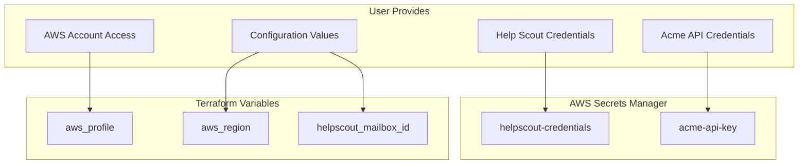
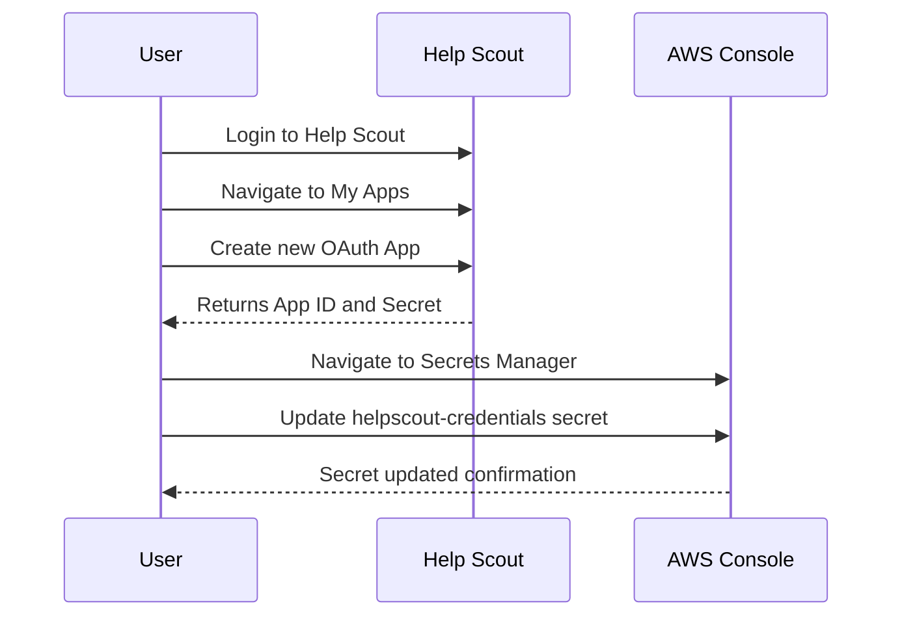
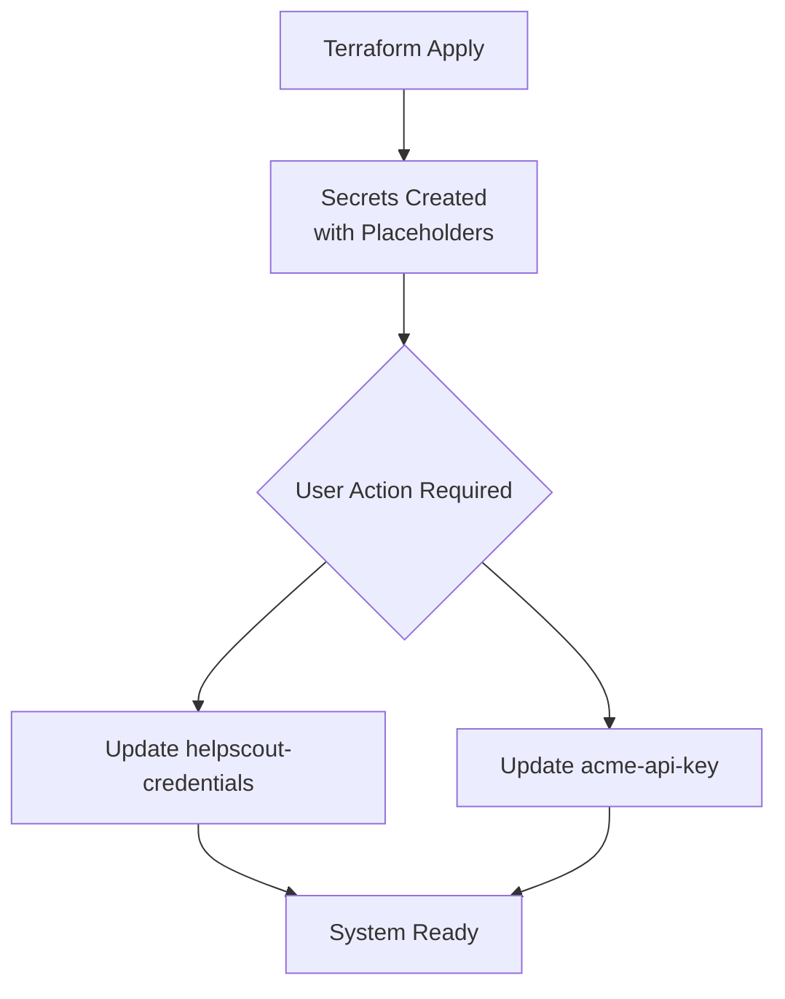

# User-Provided Items Checklist

This document lists all items that the user must provide or configure for the Support Agent AWS migration. Most secrets will be provisioned as AWS Secrets Manager entries that the user will update with actual values through the AWS Console.

## Overview



---

## Required Items Checklist

### 1. AWS Account Configuration

| Item | Description | How to Obtain | Required For |
|------|-------------|---------------|--------------|
| AWS Account ID | 12-digit AWS account number | AWS Console → Account Settings | Terraform deployment |
| AWS CLI Profile | Named profile with credentials | `aws configure --profile name` | Terraform, CLI commands |
| AWS Region | Target deployment region | User choice (e.g., us-west-2) | All AWS resources |
| IAM Permissions | Admin or specific permissions | AWS IAM Console | Resource creation |

**Required IAM Permissions:**
```json
{
  "Version": "2012-10-17",
  "Statement": [
    {
      "Effect": "Allow",
      "Action": [
        "lambda:*",
        "apigateway:*",
        "states:*",
        "secretsmanager:*",
        "iam:*",
        "logs:*",
        "xray:*",
        "s3:*"
      ],
      "Resource": "*"
    }
  ]
}
```

**Setup Instructions:**
```bash
# Configure AWS CLI profile
aws configure --profile support-agent-deploy

# Provide:
# - AWS Access Key ID
# - AWS Secret Access Key
# - Default region (e.g., us-west-2)
# - Default output format (json)

# Verify configuration
aws sts get-caller-identity --profile support-agent-deploy
```

**Validation:**
```bash
# Should return account ID and user info
aws sts get-caller-identity --profile support-agent-deploy
# Expected: {"UserId": "...", "Account": "123456789012", "Arn": "..."}
```

---

### 2. Help Scout OAuth Credentials

| Item | Description | How to Obtain | Secret Name |
|------|-------------|---------------|-------------|
| App ID | OAuth 2.0 application ID | Help Scout → My Apps | `support-agent/helpscout-credentials` |
| Secret | OAuth 2.0 application secret | Help Scout → My Apps | `support-agent/helpscout-credentials` |
| Mailbox ID | Numeric mailbox identifier | Help Scout API or console | Terraform variable |

**How to Create Help Scout OAuth App:**

1. Log into Help Scout
2. Navigate to **Your Profile → My Apps**
3. Click **Create My App**
4. Configure:
   - **App Name:** Support Agent AWS
   - **Redirection URL:** `https://localhost` (not used for client credentials)
5. Click **Create**
6. Copy the **App ID** and **App Secret**



**How to Find Mailbox ID:**

Option 1: Use existing script
```bash
# From the original project
cd ~/Code/support-agent
npm run list-mailboxes
```

Option 2: API call
```bash
# After OAuth app is created
curl -X POST https://api.helpscout.net/v2/oauth2/token \
  -d "grant_type=client_credentials&client_id=YOUR_APP_ID&client_secret=YOUR_SECRET" \
  | jq -r '.access_token' > /tmp/hs_token.txt

curl -H "Authorization: Bearer $(cat /tmp/hs_token.txt)" \
  https://api.helpscout.net/v2/mailboxes | jq '.["_embedded"]["mailboxes"][] | {id, name}'
```

**Secret Format:**
```json
{
  "app_id": "your-oauth-app-id",
  "secret": "your-oauth-app-secret"
}
```

**AWS Console Update Steps:**
1. Go to AWS Console → Secrets Manager
2. Find secret: `support-agent/helpscout-credentials`
3. Click **Retrieve secret value**
4. Click **Edit**
5. Replace placeholder values with real credentials
6. Click **Save**

---

### 3. Acme API Credentials

| Item | Description | How to Obtain | Secret Name |
|------|-------------|---------------|-------------|
| API Key | AppSync API key | Acme AWS Console | `support-agent/acme-api-key` |
| Endpoint | GraphQL endpoint URL | Acme AWS Console | `support-agent/acme-api-key` |

**Current Values from Original Project:**
```
Endpoint: https://<APPSYNC_ID>.appsync-api.us-west-2.amazonaws.com/graphql
API Key: <ACME_API_KEY>
```

> **Note:** These values are already in the original project's .env file. They can be copied directly.

**Secret Format:**
```json
{
  "api_key": "da2-xxxxxxxxxxxxxxxxxxxxxxxx",
  "endpoint": "https://xxxxxx.appsync-api.us-west-2.amazonaws.com/graphql"
}
```

**AWS Console Update Steps:**
1. Go to AWS Console → Secrets Manager
2. Find secret: `support-agent/acme-api-key`
3. Click **Retrieve secret value**
4. Click **Edit**
5. Replace placeholder values with real credentials
6. Click **Save**

---

### 4. Configuration Values

| Item | Description | Default Value | Where Used |
|------|-------------|---------------|------------|
| AWS Region | Deployment region | us-west-2 | terraform.tfvars |
| AWS Profile | CLI profile name | default | terraform.tfvars |
| Environment | Environment name | prod | terraform.tfvars |
| Mailbox ID | Help Scout mailbox | 100001 | terraform.tfvars |
| Alert Email | Email for alerts | (optional) | terraform.tfvars |

**terraform.tfvars Template:**
```hcl
# Required
aws_region           = "us-west-2"
aws_profile          = "your-profile-name"
helpscout_mailbox_id = "100001"

# Optional
environment = "prod"
alert_email = "your-email@example.com"
```

---

## Secrets Manager Update Guide

After Terraform deployment, the following secrets will be created with placeholder values. You must update them with real values.



### Quick Reference: Secrets to Update

| Secret Name | Required Fields | Status After Deploy |
|------------|-----------------|---------------------|
| `support-agent/helpscout-credentials` | app_id, secret | Placeholder - **MUST UPDATE** |
| `support-agent/acme-api-key` | api_key, endpoint | Placeholder - **MUST UPDATE** |
| `support-agent/helpscout-oauth-token` | access_token, expires_at | Empty - Auto-managed |

### Update via AWS CLI

```bash
# Set your profile
export AWS_PROFILE=your-profile-name

# Update Help Scout credentials
aws secretsmanager put-secret-value \
  --secret-id support-agent/helpscout-credentials \
  --secret-string '{
    "app_id": "YOUR_REAL_APP_ID",
    "secret": "YOUR_REAL_SECRET"
  }'

# Update Acme credentials
aws secretsmanager put-secret-value \
  --secret-id support-agent/acme-api-key \
  --secret-string '{
    "api_key": "YOUR_REAL_API_KEY",
    "endpoint": "https://your-real-endpoint.appsync-api.us-west-2.amazonaws.com/graphql"
  }'
```

### Update via AWS Console

1. Navigate to **AWS Console → Secrets Manager**
2. Click on the secret name
3. Scroll to **Secret value** section
4. Click **Retrieve secret value**
5. Click **Edit**
6. Update the JSON with real values
7. Click **Save**

---

## Help Scout Webhook Configuration

After AWS deployment, you must configure Help Scout to send webhooks to your new endpoint.

### Required Information

| Item | Value | Source |
|------|-------|--------|
| Webhook URL | `https://xxx.execute-api.region.amazonaws.com/prod/webhook` | Terraform output |
| Events | `conversation.created` | Help Scout configuration |
| Secret Key | (optional) | User-generated |

### Configuration Steps

1. **Get Webhook URL from Terraform:**
   ```bash
   cd terraform
   terraform output webhook_url
   ```

2. **Configure in Help Scout:**
   - Log into Help Scout
   - Go to **Manage → Apps → Webhooks**
   - Click **New Webhook**
   - Paste the URL from step 1
   - Select event: **conversation.created**
   - (Optional) Set a secret key for signature validation
   - Click **Save**

3. **Verify Configuration:**
   ```bash
   # Test the webhook endpoint
   curl -X POST "YOUR_WEBHOOK_URL" \
     -H "Content-Type: application/json" \
     -d '{"type":"test"}'
   # Expected: {"message":"Event ignored"} (test events are ignored)
   ```

---

## Pre-Deployment Checklist

Complete this checklist before running `terraform apply`:

### AWS Configuration
- [ ] AWS account ID noted
- [ ] AWS CLI profile configured and tested
- [ ] Sufficient IAM permissions verified
- [ ] Target region selected

### Help Scout
- [ ] OAuth application created
- [ ] App ID copied
- [ ] App Secret copied
- [ ] Mailbox ID identified

### Acme API
- [ ] API endpoint URL available
- [ ] API key available

### Local Environment
- [ ] Node.js 18+ installed
- [ ] NX CLI installed globally
- [ ] Terraform 1.5+ installed
- [ ] AWS CLI configured

---

## Post-Deployment Checklist

Complete this checklist after running `terraform apply`:

### Secrets Manager
- [ ] `support-agent/helpscout-credentials` updated with real values
- [ ] `support-agent/acme-api-key` updated with real values

### Help Scout Webhook
- [ ] Webhook URL obtained from Terraform output
- [ ] Webhook configured in Help Scout
- [ ] Event `conversation.created` selected

### Verification
- [ ] Health check endpoint returns `{"status":"healthy"}`
- [ ] Test webhook request processed successfully
- [ ] Step Functions execution visible in console
- [ ] CloudWatch logs show successful processing

---

## Troubleshooting

### "Access Denied" during Terraform apply
- Verify AWS profile has required permissions
- Check profile name in terraform.tfvars
- Run `aws sts get-caller-identity --profile your-profile` to verify

### "Invalid credentials" in Lambda logs
- Check Secrets Manager values are updated
- Verify JSON format is correct
- Ensure no trailing whitespace or newlines

### Webhook not being received
- Verify URL in Help Scout matches Terraform output
- Check API Gateway is deployed (stage = prod)
- Review Help Scout webhook logs for delivery status

### Step Function not starting
- Check webhook-handler Lambda logs
- Verify STATE_MACHINE_ARN environment variable is set
- Check IAM permissions for Lambda to invoke Step Functions

---

## Summary Table

| Category | Item | Status | Notes |
|----------|------|--------|-------|
| **AWS** | Account Access | ☐ Required | Need admin or specific permissions |
| **AWS** | CLI Profile | ☐ Required | Configure with `aws configure` |
| **Help Scout** | OAuth App ID | ☐ Required | Create in Help Scout console |
| **Help Scout** | OAuth Secret | ☐ Required | Create in Help Scout console |
| **Help Scout** | Mailbox ID | ☐ Required | From API or console |
| **Acme** | API Endpoint | ☐ Required | Copy from original .env |
| **Acme** | API Key | ☐ Required | Copy from original .env |
| **Config** | AWS Region | ☐ Required | Default: us-west-2 |
| **Config** | Alert Email | ☐ Optional | For CloudWatch alarms |
| **Post-Deploy** | Update Secrets | ☐ Required | Via AWS Console or CLI |
| **Post-Deploy** | Configure Webhook | ☐ Required | In Help Scout console |
