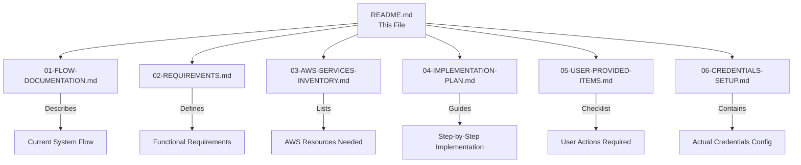
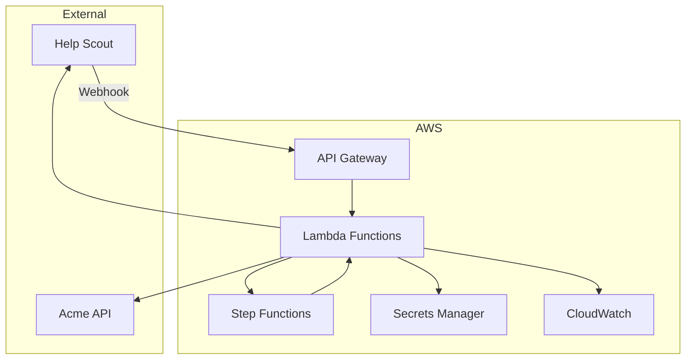

# Support Agent AWS Migration Documentation

This folder contains comprehensive documentation for migrating the Support Agent from n8n to AWS-native infrastructure.

## Document Index

## Documents

| # | Document | Purpose | Audience |
|---|----------|---------|----------|
| 01 | [Flow Documentation](./01-FLOW-DOCUMENTATION.md) | Detailed workflow diagrams and process flows | Developers, Architects |
| 02 | [Requirements](./02-REQUIREMENTS.md) | Generic functional and non-functional requirements | Developers, Project Managers |
| 03 | [AWS Services Inventory](./03-AWS-SERVICES-INVENTORY.md) | Complete list of AWS services and Terraform resources | DevOps, Cloud Engineers |
| 04 | [Implementation Plan](./04-IMPLEMENTATION-PLAN.md) | Step-by-step implementation guide with validation | LLM Agents, Developers |
| 05 | [User-Provided Items](./05-USER-PROVIDED-ITEMS.md) | Checklist of credentials and configuration needed | End Users, Administrators |
| 06 | [Credentials Setup](./06-CREDENTIALS-SETUP.md) | Actual credentials and AWS profile configuration | Administrators |

## Quick Start

1. **Understand the System:** Start with [01-FLOW-DOCUMENTATION.md](./01-FLOW-DOCUMENTATION.md)
2. **Review Requirements:** Read [02-REQUIREMENTS.md](./02-REQUIREMENTS.md)
3. **Plan Infrastructure:** Review [03-AWS-SERVICES-INVENTORY.md](./03-AWS-SERVICES-INVENTORY.md)
4. **Gather Credentials:** Complete [05-USER-PROVIDED-ITEMS.md](./05-USER-PROVIDED-ITEMS.md)
5. **Implement:** Follow [04-IMPLEMENTATION-PLAN.md](./04-IMPLEMENTATION-PLAN.md)

## Architecture Overview

## Technology Stack

| Component | Technology |
|-----------|------------|
| Language | TypeScript |
| Build Tool | NX |
| Infrastructure | Terraform |
| Compute | AWS Lambda |
| Orchestration | AWS Step Functions |
| API | AWS API Gateway |
| Secrets | AWS Secrets Manager |
| Monitoring | AWS CloudWatch |

## Migration Summary

### From (n8n)
- n8n workflow engine
- Code nodes with inline JavaScript
- Manual credential management
- n8n hosting/maintenance required

### To (AWS)
- Serverless Lambda functions
- Step Functions orchestration
- AWS Secrets Manager for credentials
- Fully managed, pay-per-use

## Key Benefits

- **Scalability:** Automatic scaling with Lambda
- **Cost:** Pay only for actual usage
- **Reliability:** AWS managed services SLA
- **Security:** Native AWS IAM and Secrets Manager
- **Observability:** Built-in CloudWatch integration
- **Maintainability:** Infrastructure as code with Terraform

## Contact

For questions or issues with this migration, please refer to the original n8n project documentation or contact the development team.
